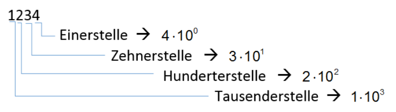
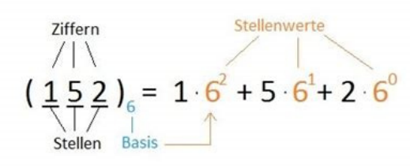

In einem Stellenwertsystem hat jede Stelle einen Wert. Er beträgt:   

**Basis**<sup>Stellenposition, bei 0 beginnend</sup>  

**Bsp (Dezimal)**: 10<sup>2</sup> = 100 (3 Stellen -> 0 1 2)  
**Bsp (Binär)**: 2<sup>7</sup> = 1000 0000 (8 Stellen -> 0 1 2 3 4 5 6 7)  

  



| Stellenwertsystem | Basis | Ziffern  |
| :---------------: | :---: | :------: |
|   Dezimalsystem   |  10   |   0-9    |
|    Binärsystem    |   2   |   0-1    |
|    Oktalsystem    |   8   |   0-7    |
| Hexadezimalsystem |  16   | 0-9, A-F |


| 2<sup>0</sup> | 2<sup>1</sup>  | 2<sup>2</sup>  | 2<sup>3</sup>  | 2<sup>4</sup>  | 2<sup>5</sup>  | 2<sup>6</sup>  | 2<sup>7</sup>  | 2<sup>8</sup>  |
| :-----------: | :------------: | :------------: | :------------: | :------------: | :------------: | :------------: | :------------: | :------------: |
|       1       |       2        |       4        |       8        |       16       |       32       |       64       |      128       |      256       |
| **2<sup>9</sup>** | **2<sup>10</sup>** | **2<sup>11</sup>** | **2<sup>12</sup>** | **2<sup>13</sup>** | **2<sup>14</sup>** | **2<sup>15</sup>** | **2<sup>16</sup>** | **2<sup>17</sup>** |
|      512      |      1024      |      2056      |      4096      |      8192      |     16384      |     32768      |     65536      |     131072     |

### Binär zu Dezimal

|         1         |         1         |         0         |         1         |         0         |         0         |         1         |         0         |   Binär   |
| :---------------: | :---------------: | :---------------: | :---------------: | :---------------: | :---------------: | :---------------: | :---------------: | :-------: |
| 1 x 2<sup>7</sup> | 1 x 2<sup>6</sup> | 0 x 2<sup>5</sup> | 1 x 2<sup>4</sup> | 0 x 2<sup>3</sup> | 0 x 2<sup>2</sup> | 1 x 2<sup>1</sup> | 0 x 2<sup>0</sup> | **Summe** |
|        128        |        64         |         0         |        16         |         0         |         0         |         2         |         0         |   = 210   |
### Binär zu Hexadecimal

- Binärzahl in 4er Blöcke aufteilen.
- Fehlende Nullen beim vordersten Block auffüllen und mit unten stehender Tabelle umrechnen
- Die Umrechnung Hexadecimal zu Binär erfolgt analog nur umgekehrt

| Hex | Binär | Hex | Binär |
| :-: | :---: | :-: | :---: |
|  0  | 0000  |  8  | 1000  |
|  1  | 0001  |  9  | 1001  |
|  2  | 0010  |  A  | 1010  |
|  3  | 0011  |  B  | 1011  |
|  4  | 0100  |  C  | 1100  |
|  5  | 0101  |  D  | 1101  |
|  6  | 0110  |  E  | 1110  |
|  7  | 0111  |  F  | 1111  |
### Dezimal zu Binär
```
Das Ergebnis wird von unten nach oben gelesen!

94 / 2 = 47 Rest 0  ^
47 / 2 = 23 Rest 1  ^
23 / 2 = 11 Rest 1  ^
11 / 2 = 5  Rest 1  ^
5  / 2 = 2  Rest 1  ^
2  / 2 = 1  Rest 0  ^
1  / 2 = 0  Rest 1  ^

= 1011110
```

### Dezimal zu Hexadezimal

1. Dezimal zu Binär umrechnen
2. Binärzahl in 4er Blöcke einteilen und fehlende Nullen auffüllen
3. Die 4er Blöcke zu Hexadezimalzahlen umrechnen (siehe Tabelle)

### Hexadezimal zu Dezimal

|         2          |          A          |         5          |          E          | Hexadecimal |
| :----------------: | :-----------------: | :----------------: | :-----------------: | :---------- |
| 2 x 16<sup>3</sup> | 10 x 16<sup>2</sup> | 5 x 16<sup>1</sup> | 14 x 16<sup>0</sup> | **Summe**   |
|        8192        |        2560         |         80         |         14          | = 10846     |

### Binäre Arithmetik


1. **Binäres Addieren**  
    (z. B.: 1010 + 0101)

   - Stelle 1: 0 + 1 = 1 von rechts
   - Stelle 2: 1 + 0 = 1
   - Stelle 3: 0 + 1 = 1
   - Stelle 4: 1 + 0 = 1  

   =========================  
   **Ergebnis:** 1111  

   (Hinweis: Bei 1+1 schreibt man 0 und überträgt 1.)

2. **Binäres Subtrahieren**  
     (z. B.: 1010 - 0101)

   - Stelle 1: 0 - 1 → nicht möglich, also leihen => 10<sub>2</sub> - 1 = 1; nächst höhere Stelle wird um 1 reduziert.
   - Stelle 2: (1-1) = 0 (wegen Leihen)
   - Stelle 3: 0 - 1 → wieder leihen => 10<sub>2</sub> - 1 = 1; nächst höhere Stelle um 1 reduziert.
   - Stelle 4: (1-1) = 0  
   
   =========================  
   **Ergebnis:** 0101  

   (Hinweis: Leihen im Binärsystem entspricht dem Hinzufügen von 2.)

3. **Bitweise Operationen**  
(Bit-für-Bit, bei gleicher Stellenzahl):  

```
   a) AND:

      - Regel: Nur 1, wenn beide Bits 1 sind; sonst 0.

        1010  
      & 0101 
      = 0000  

   b) OR:

      Regel: 1, wenn mindestens ein Bit 1 ist.

        1010 
      | 0101 
      = 1111

   c) XOR:

      Regel: 1, wenn die Bits unterschiedlich sind; sonst 0.

      1010 
    ^ 0101 
    = 1111
```
