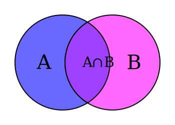

### Mengen:

- enthalten keine Duplikate
- werden als ganzes betrachtet  

### Vereiningungsmenge

- Die Vereinigung A∪B ist die Menge, die alle Elemente aus A und B enthält, ohne Duplikate.
- A ∪ B (Equivalent zum logischen oder: In A oder in B)
- A ∪ B = **Summe der Elemente** beider Mengen
  

### Schnittmenge

- Die Schnittmenge A∩B ist die Menge, die alle Elemente enthält, die sowohl in A als auch in B vorkommen.
-  A ∩ B (Equivalent zum logischen und: Sowohl in A als auch in B)
- A ∩ B = Elemente **die in beiden Mengen** vorkommen

### Differenzmenge

- Die Differenzmenge A / B enthält alle Elemente, die in A sind, aber nicht in B.
- entspricht A ohne B oder A - B
- A / B = Elemente die **nur in A** vorkommen  

### Teilmenge
- C ist Teilmenge von B (C ⊆ B), wenn jedes Element von C auch ein Element von B ist
- C darf = B sein!

### Echte Teilmenge
- A ist eine **echte** Teilmenge von B (A ⊂ B), wenn jedes Element von A auch ein Element von B ist, B aber nicht = A ist.
- A ⊂ B gilt, wenn alle Elemente von A auch in B sind und B mind. eine weiteres Element enthält.

