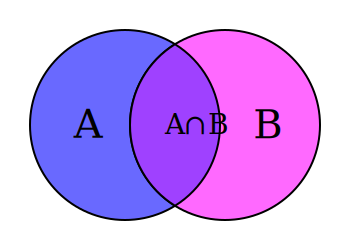
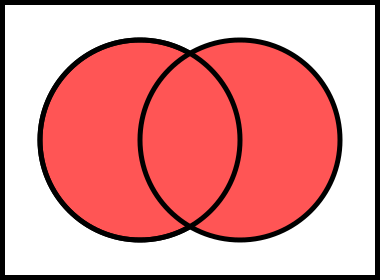
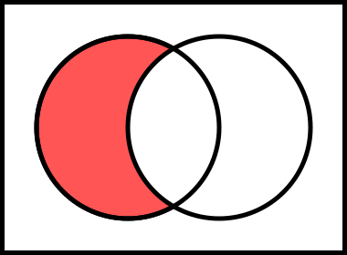

import img_teilmenge from './img/Example_of_C_is_no_proper_subset_of_B.svg.png';
import img_echteteilmenge from './img/Example_of_A_is_a_proper_subset_of_B.svg.png';

### Mengen:

- enthalten keine Duplikate
- werden als ganzes betrachtet



### Vereiningungsmenge

- Die Vereinigung A∪B ist die Menge, die alle Elemente aus A und B enthält, ohne Duplikate.
- A ∪ B (Equivalent zum logischen oder: In A oder in B)
- A ∪ B = **Summe der Elemente** beider Mengen  



<details>
<summary>**Exkurs:** SQL UNION</summary>

- Every SELECT statement within UNION must have the same number of columns
- The columns must also have similar data types
- The columns in every SELECT statement must also be in the same order

The UNION operator selects only distinct values by default. To allow duplicate values, use UNION ALL

```sql
SELECT column_name(s) FROM table1
UNION
SELECT column_name(s) FROM table2;
```
</details>

### Schnittmenge

- Die Schnittmenge A∩B ist die Menge, die alle Elemente enthält, die sowohl in A als auch in B vorkommen.
-  A ∩ B (Equivalent zum logischen und: Sowohl in A als auch in B)
- A ∩ B = Elemente **die in beiden Mengen** vorkommen


<details>
<summary>**Exkurs:** SQL INTERSECT</summary>

- Returns only the common rows between two result sets.
- Ensures uniqueness by automatically removing duplicate rows.
- Requires that both SELECT statements have the same number of columns.
- The data types of corresponding columns in both queries must be compatible.

```sql
SELECT CustomerID
FROM Customers
INTERSECT
SELECT CustomerID
FROM Orders;
```
</details>

### Differenzmenge

- Die Differenzmenge A / B enthält alle Elemente, die in A sind, aber nicht in B.
- entspricht A ohne B oder A - B
- A / B = Elemente die **nur in A** vorkommen



<details>
<summary>**Exkurs:** SQL EXCEPT</summary>

- EXCEPT in SQL, MINUS in anderen SQL Dialekten (Oracle, IBM DB2)
- Ensures uniqueness by automatically removing duplicate rows (distinct).
- Requires that both SELECT statements have the same number of columns.
- The data types of corresponding columns in both queries must be compatible.

```sql
-- alle Mitarbeiter aus employees_germany, die nicht in employees_france sind
SELECT id, name FROM employees_germany
EXCEPT
SELECT id, name FROM employees_france;
```
</details>

### Teilmenge
- C ist Teilmenge von B (C ⊆ B), wenn jedes Element von C auch ein Element von B ist
- C darf = B sein!


### Echte Teilmenge
- A ist eine **echte** Teilmenge von B (A ⊂ B), wenn jedes Element von A auch ein Element von B ist, B aber nicht = A ist.
- A ⊂ B gilt, wenn alle Elemente von A auch in B sind und B mind. eine weiteres Element enthält.


