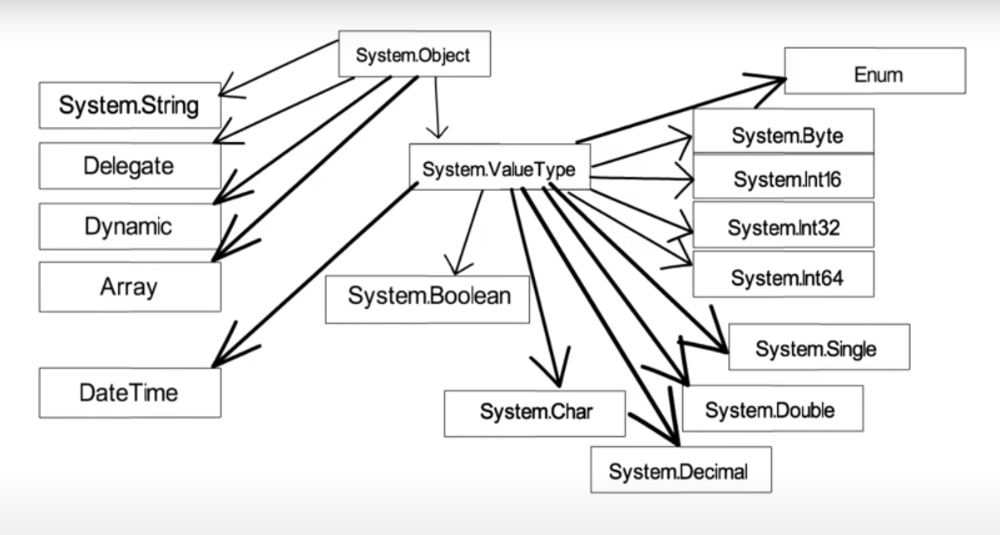
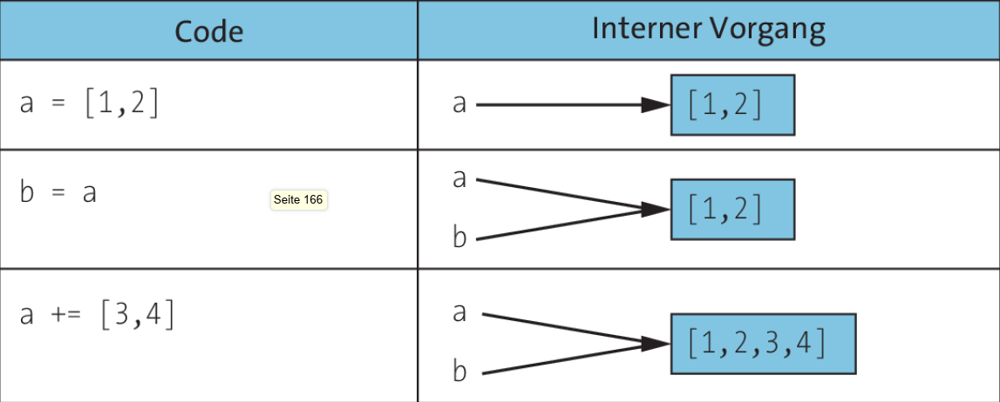
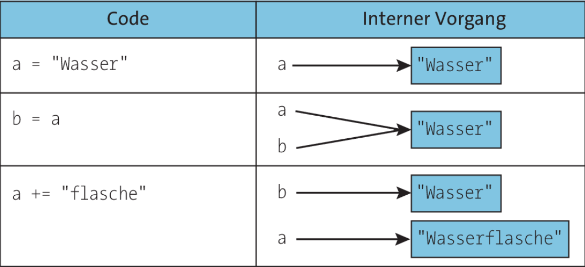

## **Data Types**

*Data Types in C#*

## **Value Types**

- Direkt auf dem **Stack** gespeichert (schnell)
- Wert wird direkt kopiert, wenn zugewiesen (x = y → Kopie von y)
- Enthalten den tatsächlichen Wert, nicht eine Referenz.
- Kein null möglich, außer mit `Nullable<T>` (int?, double?, etc.)

### Primitive Datentypen

- Alle primitiven Datentypen (int, double, etc.) sind Value Types, weil sie direkt auf dem Stack gespeichert werden.
- Nicht alle Value Types sind primitive Datentypen, weil struct, enum, DateTime oder `Tuple<T1, T2>` auch Value Types sind, aber keine primitiven Datentypen.

| **Kategorie** | **Beispiele** | **Beschreibung** |
| :----------------------- | :--------------------------------------------------------------------------------------------------------------- | :-------------------------------------------------------------------------------------------------- |
| **Primitive Datentypen** | `int`, `double`, `bool`, `char`, `byte`, `float`, `decimal`, `short`, `long`, `sbyte`, `ushort`, `uint`, `ulong` | Basieren direkt auf `struct`, haben vordefinierte Größen und keine eigene Logik. |
| **Value Types** | **Alle primitiven Datentypen +** `enum`, `struct`, `Tuple<T1, T2>`, `bool`, `DateTime`, `decimal`, `TimeSpan` | Werttypen, die entweder **primitive Typen** oder **benutzerdefinierte Strukturen (`struct`)** sind. |
## **Reference Types**

- Werden auf dem **Heap** gespeichert, aber die Referenz darauf liegt im Stack.
- Speichern eine **Referenz (Zeiger) auf die Daten**, nicht den Wert selbst.
- Eine Zuweisung kopiert die Referenz, nicht die Daten (Änderungen wirken sich auf alle Referenzen aus).

| Typ | Beschreibung |
| :---------- | :---------------------------------------------------------- |
| `class` | Definiert komplexe Objekte mit Methoden und Eigenschaften. |
| `interface` | Definiert ein Verhalten, das Klassen implementieren müssen. |
| `delegate` | Referenz auf eine Methode (wie ein Funktionszeiger). |
| `array` | Sammlung von Elementen gleichen Typs mit fester Größe. |
| `string` | Eine Zeichenkette (immutable, ändert sich nicht direkt). |

## Mutable Types

Veränderbare Typen sind Objekte, deren Inhalt nach ihrer Erstellung geändert werden kann. Änderungen können durch Hinzufügen, Entfernen oder Ändern von Elementen innerhalb des Objekts erfolgen.

**Beispiel: Set (Menge)**

Ein Set in Python ist eine Sammlung eindeutiger, ungeordneter Elemente. Sets sind veränderbar, was bedeutet, dass du Elemente hinzufügen oder entfernen kannst.

- Die Variable speichert eine Referenz auf das Objekt.
- Wenn eine andere Variable darauf zeigt, beeinflussen Änderungen beide.

**Referenzierung im Speicher bei Mutable Types** 

## Immutable Types

Unveränderbare Typen sind Objekte, deren Inhalt nach ihrer Erstellung nicht geändert werden kann. Wenn du versuchst, den Inhalt eines unveränderbaren Typs zu ändern, musst du ein neues Objekt erstellen.

**Beispiel: Tuple (Tupel)**

Ein Tupel in Python ist eine geordnete Sammlung von Elementen. Tupel sind unveränderbar, was bedeutet, dass du ihre Elemente nach der Erstellung nicht ändern kannst.

- Änderungen erzeugen ein neues Objekt im Speicher.
- Die ursprüngliche Variable bleibt unberührt.

**Refrenzierung im Speicher bei Immutable Types**

**Wann sollte man immutable Typen verwenden?**

- **Thread-Sicherheit:** Immutable Typen sind automatisch thread-safe.
- **Datenintegrität:** Unveränderbare Objekte vermeiden ungewollte Seiteneffekte.
- **Value Objects (DDD):** Gut für Konzepte wie Geld (`Money`) oder Punkte (`Point`).

(DDD = Domain Driven Design)

## Stack und Heap

Die Begriffe Stack und Heap stammen aus der Informatikgeschichte und haben ihre Wurzeln in der frühen Speicherverwaltung von Computern. Ihre Konzepte wurden über Jahrzehnte hinweg entwickelt und sind heute fundamentale Bestandteile moderner Programmiersprachen.

- Mutable oder immutable hat nichts mit Stack oder Heap zu tun!
- sind nicht physisch getrennt, sondern werden logisch organisiert
- Die Speicherverwaltung erfolgt größtenteils automatisch

### Vergleich Stack vs. Heap

| Eigenschaft      | Stack                             | Heap                           |
| :--------------- | :-------------------------------- | :----------------------------- |
| Geschwindigkeit  | Sehr schnell                      | Langsam                        |
| Speicherort      | Lokale Variablen, Methodenaufrufe | Objekte, Referenztypen         |
| Speicherfreigabe | Automatisch (LIFO)                | Garbage Collector              |
| Speicherung von  | Werttypen                         | Referenztypen                  |
| Lebensdauer      | Bis Methode endet                 | Unbekannt (bis GC es entfernt) |

  
**Wer verwaltet Stack und Heap in .NET?**

**Stack**: Wird durch den Thread-Speicher verwaltet.

- Jeder Thread hat seinen eigenen Stack.
- Die Verwaltung erfolgt automatisch durch die CLR.

**Heap**: Wird durch den Garbage Collector (GC) verwaltet.

- Objekte im Heap bleiben bestehen, bis der GC sie entfernt.
- Die Speicherverwaltung erfolgt automatisch durch die CLR.

### Historischer Vergleich

| Konzept   | Ursprung                                          | Erste Implementierung   | Zweck                                                          |
| :-------- | :------------------------------------------------ | :---------------------- | :------------------------------------------------------------- |
| **Stack** | Frühe CPU-Architektur, Assembler                  | Burroughs B5000 (1961)  | Schnelle, automatische Speicherverwaltung für Funktionsaufrufe |
| **Heap**  | Dynamische Speicherverwaltung, frühe Hochsprachen | LISP (1959), C (1970er) | Flexibler Speicher für Objekte mit unbestimmter Lebensdauer    |

