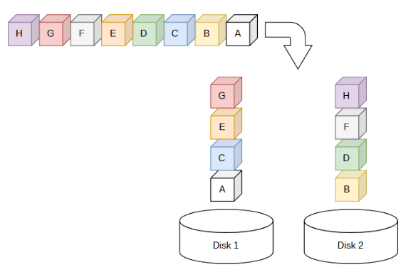
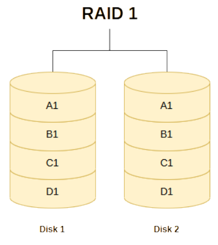
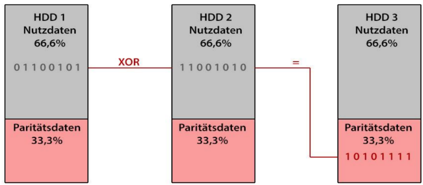
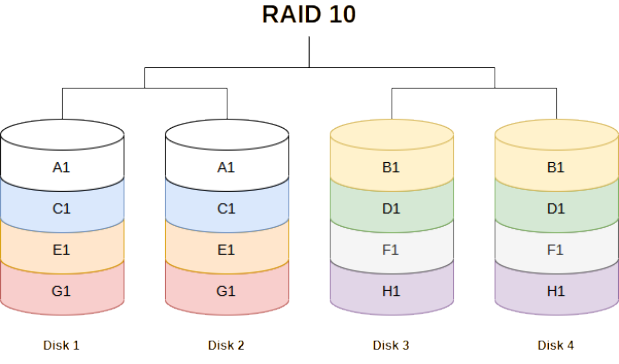

**RAID** = **R**edundant **A**rray of **I**ndependent **D**isks

### Raid 0
- kein "echter" RAID
- Verteilung der Daten auf 2 Festplatten durch **Striping**
- erhöhte Lese- und Schreibgeschwindigkeit
- Keine Redundanz, keine Datenausfallsicherheit

### Raid 1
- **Mirroring** spiegelt Daten auf mehrere Festplatten
- Alle Platten enthalten dieselben Daten
- Alle Platten bis auf eine dürfen ausfallen

### Raid 5
- Daten werden per **Striping** auf mehrere Platten verteilt
- Aus der Gesamtheit der Daten werden **Paritätsdaten** gebildet die wiederum auf die Platten verteilt werden
- Mindestens 3 Festplatten: Solange 2 Intakt sind lassen sich die verlorenen Daten wieder herstellen

### Raid 6
- Verteilung der Daten auf mehrere Platten per **Striping**
- **Paritätsdaten** werden **doppelt erzeugt**
- Mindestens 4 Platten werden benötigt
- Hohe Ausfallsicherheit (2 Platten dürfen ausfallen)

### Raid 10
- Kombination aus Raid 1 und Raid 0
- Letzte Zahl bildet das "Dach"
- Maximal 2 Platten dürfen ausfallen (aber die richtigen..)

### Zusammenfassung

| Merkmal                          |  RAID 0   |    RAID 1     |        RAID 5        |             RAID 6             |       RAID 10        |      RAID 61       |
| :------------------------------- | :-------: | :-----------: | :------------------: | :----------------------------: | :------------------: | :----------------: |
| **Mindestanzahl an Festplatten** |     2     |       2       |          3           |               4                |          4           |         6          |
| **Technik**                      | Striping  |   Mirroring   | Striping mit Parität | Striping mit doppelter Parität | Mirroring + Striping | Mirroring + RAID 6 |
| **Netto-Kapazität**              |   100%    |      50%      |       (n-1)/n        |            (n-2)/n             |         50%          |      (n-2)/2n      |
| **Maximal mögliche Ausfälle**    |     0     | 1 pro Spiegel |          1           |               2                |    1 pro Spiegel     | 2 pro RAID 6-Array |
| **Kosten**                       |  Niedrig  |     Hoch      |        Mittel        |              Hoch              |      Sehr hoch       |    Extrem hoch     |
| **Lesegeschwindigkeit**          | Sehr hoch |     Hoch      |         Hoch         |              Hoch              |      Sehr hoch       |        Hoch        |
| **Schreibgeschwindigkeit**       | Sehr hoch |    Mittel     |        Mittel        |            Niedrig             |         Hoch         |      Niedrig       |

n = Anzahl der Festplatten im Verbund:

**Zum Beispiel:**

- **RAID 5 mit 4 Festplatten** → Netto-Kapazität = 4−1 / 4=75% 
- **RAID 6 mit 6 Festplatten** → Netto-Kapazität = 6−2 / 6=66,7%
- **RAID 10 mit 4 Festplatten** → Netto-Kapazität = **50%**, weil immer zwei Festplatten gespiegelt werden