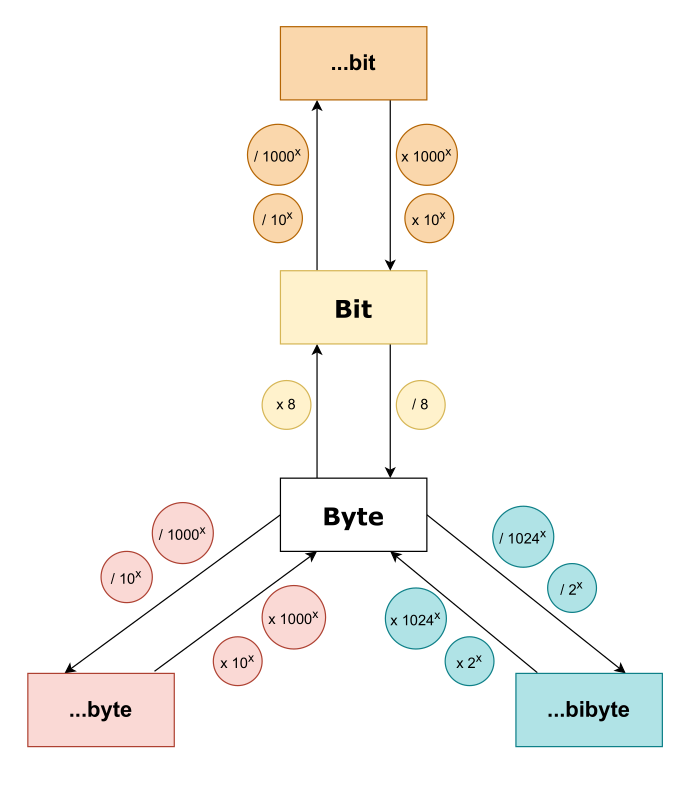

### Grundlegende Einheiten
- **Bit (b):** Kleinste Informationseinheit (0 oder 1)
- **Byte (B):** 1 Byte = 8 Bit

### Dezimale Einheiten (SI)
- **Kilobyte (KB):** 1 KB = 1.000 Byte
- **Megabyte (MB):** 1 MB = 1.000 KB = 1.000.000 Byte
- **Gigabyte (GB):** 1 GB = 1.000 MB = 1.000.000.000 Byte
- **Terabyte (TB):** 1 TB = 1.000 GB = 1.000.000.000.000 Byte

### Binäre Einheiten (IEC)
- **Kibibyte (KiB):** 1 KiB = 1024 Byte
- **Mebibyte (MiB):** 1 MiB = 1024 KiB = 1.048.576 Byte
- **Gibibyte (GiB):** 1 GiB = 1024 MiB = 1.073.741.824 Byte

### Umrechnung von Datengrößen

