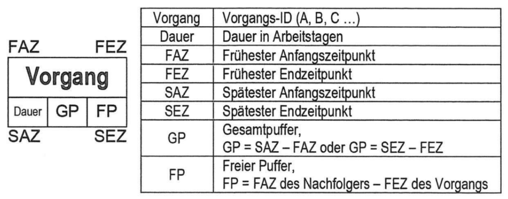
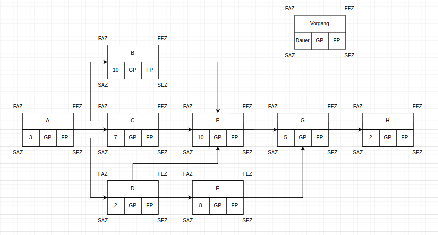
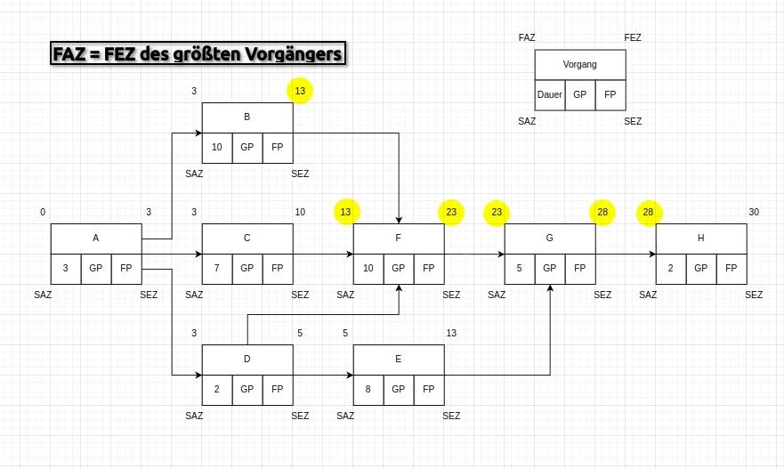
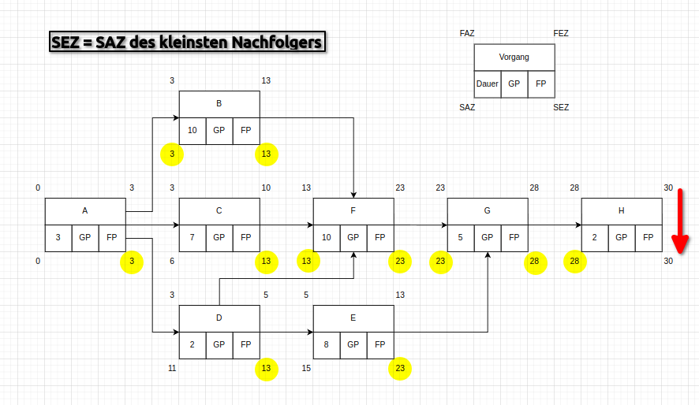
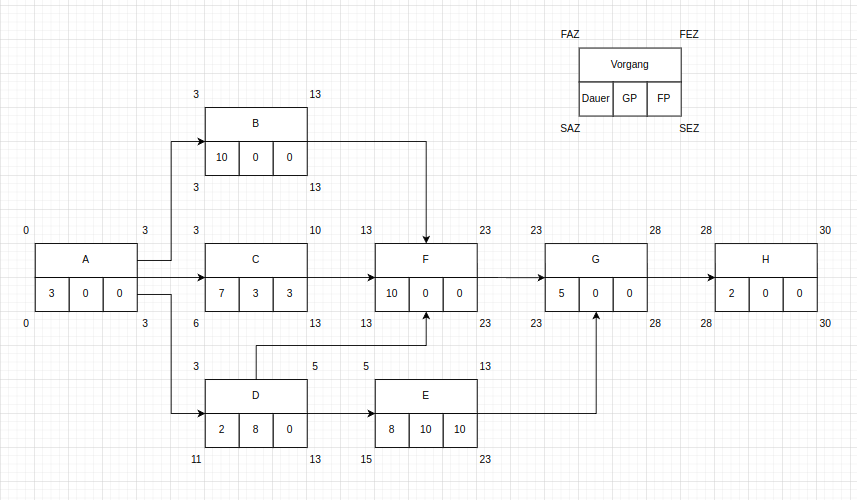

### Erstellung eines Netzplanes

| Vorgang | Dauer | Nachfolger | ggfs Bezeichnung                      |
| ------- | ----- | ---------- | ------------------------------------- |
| A       | 3     | B,C,D      | Transport/Anlieferung                 |
| B       | 10    | F          | Vormontage Prozessstation             |
| C       | 7     | F          | Vormontage Transportband              |
| D       | 2     | E,F        | Anpassung Steuereinheit               |
| E       | 8     | G          | Programmierung Steuereinheit          |
| F       | 10    | G          | Montage Gesamtsystem                  |
| G       | 5     | H          | Test Gesamtsystem                     |
| H       | 2     | -          | Einweisung der Produktionsmitarbeiter |

### Schritt 1 Ablaufplan

- Anlegen aller Vorgänge mit den schon bekannten Größen und Verknüpfungen

### Schritt 2 Vorwärtsrechnung

- Früheste Anfangszeitpunkte **FAZ = FEZ des größten Vorgängers**
- Früheste Endzeitpunkte **FEZ = FAZ + Dauer**

### Schritt 3 Rückwärtsrechnung

- Spätester Anfangszeitpunkt **SAZ = SEZ - Dauer**
- Spätester Endzeitpunkt **SEZ = SAZ des kleinsten Nachfolgers**

### Schritt 4 Pufferzeiten

- **Gesamtpuffer** = SEZ - FEZ oder SAZ - FAZ  
	maximale Verschiebung eines Vorgangs oder dessen Verlängerung in die Zukunft ohne
	dass sich dadurch das Projektende verschiebt
- **Freier Puffer** = niedrigster FAZ (Nachfolger) - FEZ  
	beschreibt, wie weit ein Vorgang verschoben oder verlängert werden kann, ohne dass es Einfluss auf die Lage der benachbarten Vorgänge hat

### Schritt 5 Kritischer Pfad

Aufeinanderfolgende Vorgänge ohne Puffer:  
**A => B => F => G => H**

