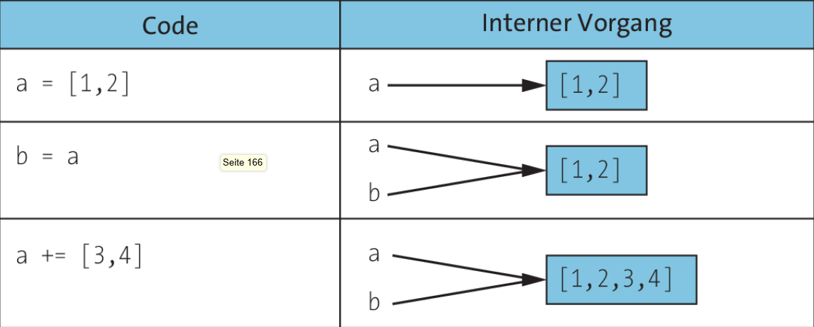
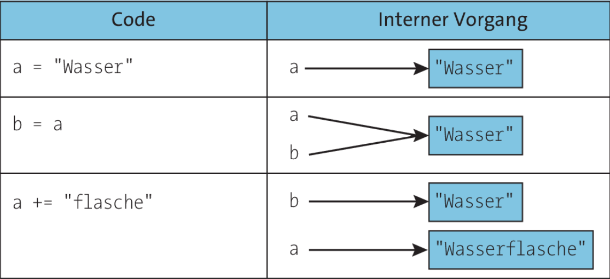

## Veränderbare Typen (Mutable Types)

Veränderbare Typen sind Objekte, deren Inhalt nach ihrer Erstellung geändert werden kann. Änderungen können durch Hinzufügen, Entfernen oder Ändern von Elementen innerhalb des Objekts erfolgen.

**Beispiel: Set (Menge)**

Ein Set in Python ist eine Sammlung eindeutiger, ungeordneter Elemente. Sets sind veränderbar, was bedeutet, dass du Elemente hinzufügen oder entfernen kannst.

- Die Variable speichert eine Referenz auf das Objekt.
- Wenn eine andere Variable darauf zeigt, beeinflussen Änderungen beide.

**Referenzierung im Speicher bei Mutable Types** 

### C# - Referenz Typen (Reference Types)
-> Mutable Verhalten

Referenztypen werden auf dem Heap gespeichert, während die Variable selbst auf dem Stack eine Referenz auf den Heap-Speicher enthält.
Dazu gehören Klassen (class), Arrays und string.

## Unveränderbare Typen (Immutable Types)

Unveränderbare Typen sind Objekte, deren Inhalt nach ihrer Erstellung nicht geändert werden kann. Wenn du versuchst, den Inhalt eines unveränderbaren Typs zu ändern, musst du ein neues Objekt erstellen.

**Beispiel: Tuple (Tupel)**

Ein Tupel in Python ist eine geordnete Sammlung von Elementen. Tupel sind unveränderbar, was bedeutet, dass du ihre Elemente nach der Erstellung nicht ändern kannst.

- Änderungen erzeugen ein neues Objekt im Speicher.
- Die ursprüngliche Variable bleibt unberührt.

**Refrenzierung im Speicher bei Immutable Types**

### C# - Werttypen (Value Types)
-> Immutable Verhalten

Werttypen werden auf dem Stack gespeichert und kopiert, wenn sie einer neuen Variable zugewiesen werden.
Dazu gehören primitive Datentypen wie int, double, bool, aber auch Strukturen (struct).

**Wann sollte man immutable Typen verwenden?**

- **Thread-Sicherheit:** Immutable Typen sind automatisch thread-safe.
- **Datenintegrität:** Unveränderbare Objekte vermeiden ungewollte Seiteneffekte.
- **Value Objects (DDD):** Gut für Konzepte wie Geld (`Money`) oder Punkte (`Point`).

(DDD = Domain Driven Design)

## Stack und Heap
Die Begriffe Stack und Heap stammen aus der Informatikgeschichte und haben ihre Wurzeln in der frühen Speicherverwaltung von Computern. Ihre Konzepte wurden über Jahrzehnte hinweg entwickelt und sind heute fundamentale Bestandteile moderner Programmiersprachen.

- Mutable oder immutable hat nichts mit Stack oder Heap zu tun!
- sind nicht physisch getrennt, sondern werden logisch organisiert
- Die Speicherverwaltung erfolgt größtenteils automatisch

### Vergleich Stack vs. Heap

| Eigenschaft      | Stack                             | Heap                           |
| :--------------- | :-------------------------------- | :----------------------------- |
| Geschwindigkeit  | Sehr schnell                      | Langsam                        |
| Speicherort      | Lokale Variablen, Methodenaufrufe | Objekte, Referenztypen         |
| Speicherfreigabe | Automatisch (LIFO)                | Garbage Collector              |
| Speicherung von  | Werttypen                         | Referenztypen                  |
| Lebensdauer      | Bis Methode endet                 | Unbekannt (bis GC es entfernt) |

  
**Wer verwaltet Stack und Heap in .NET?**

**Stack**: Wird durch den Thread-Speicher verwaltet.

- Jeder Thread hat seinen eigenen Stack.
- Die Verwaltung erfolgt automatisch durch die CLR.

**Heap**: Wird durch den Garbage Collector (GC) verwaltet.

- Objekte im Heap bleiben bestehen, bis der GC sie entfernt.
- Die Speicherverwaltung erfolgt automatisch durch die CLR.

### Historischer Vergleich

| Konzept   | Ursprung                                          | Erste Implementierung   | Zweck                                                          |
| :-------- | :------------------------------------------------ | :---------------------- | :------------------------------------------------------------- |
| **Stack** | Frühe CPU-Architektur, Assembler                  | Burroughs B5000 (1961)  | Schnelle, automatische Speicherverwaltung für Funktionsaufrufe |
| **Heap**  | Dynamische Speicherverwaltung, frühe Hochsprachen | LISP (1959), C (1970er) | Flexibler Speicher für Objekte mit unbestimmter Lebensdauer    |

