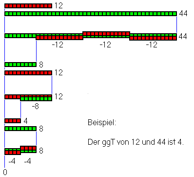

import Tabs from '@theme/Tabs';
import TabItem from '@theme/TabItem';

Suche nach dem größten gemeinsamen Teiler (**GGT**)



<Tabs>
  <TabItem value="euklid-old" label="Euklid (klassisch)" default>
    ```pseudocode title="Pseudocode"
    Funktion EuklidKlassisch(a, b)
    IF a := 0 THEN
        Ergebnis := b
    ELSE
        WHILE b ungleich 0 DO
            IF a > b THEN
                a := a - b
            ELSE
                b := b - a
        Ergebnis := a
    ```
  </TabItem>
  <TabItem value="euklid-old-recursive" label="Euklid (klassisch-rekursiv)">
    ```pseudocode title="Pseudocode"
    Funktion EuklidKlassischRekursiv(a,b)
    IF b := 0 THEN
        Ergebnis := a
    ELSE
        IF a := 0 THEN
            Ergebnis := b
        ELSE
            IF a > b THEN
                Ergebnis := EuklidKlassischRekursiv(a - b, b)
            ELSE
                Ergebnis := EuklidKlassischRekursiv(a, b - a)
    ```
  </TabItem>
  <TabItem value="banana" label="Euklid (modern-rekursiv)">
    ```pseudocode title="Pseudocode"
    Funktion EuklidModern(a,b)
    IF b := 0 THEN
        Ergebnis := a
    ELSE
        Ergebnis := EuklidModern(b, a % b)
    ```
  </TabItem>
</Tabs>

<Tabs>
  <TabItem value="euklid-old" label="Euklid (klassisch)" default>
    ```c title="C#"
    static int EuklidKlassisch(int a, int b)
    {
        if (a == 0)
            return b;
        else
        {
            while (b != 0)
            {
                if (a > b)
                    a = a - b;
                else
                    b = b - a;
            }
        }
        return a;
    }
    ```
  </TabItem>
  <TabItem value="euklid-old-recursive" label="Euklid (klassisch-rekursiv)">
    ```c title="C#"
    static int EuklidKlassischRekursiv(int a, int b)
    {
        if (b == 0)
            return a;
        else
        {
            if (a == 0)
                return b;
            else
            {
                if (a > b)
                    return EuklidKlassischRekursiv(a - b, b);
                else
                    return EuklidKlassischRekursiv(a, b - a);
            }
        }
    }
    ```
  </TabItem>
  <TabItem value="euklid-modern" label="Euklid (modern-rekursiv)">
    ```c title="C#"
    static int EuklidModern(int a, int b)
    {
        if (b == 0)
        {
            return a;
        }
        else return EuklidModern(b, a % b);
    }
    ```
  </TabItem>
</Tabs>

### Referenz
[**Wikipedia: Euklidischer Algorithmus**](https://de.wikipedia.org/wiki/Euklidischer_Algorithmus)