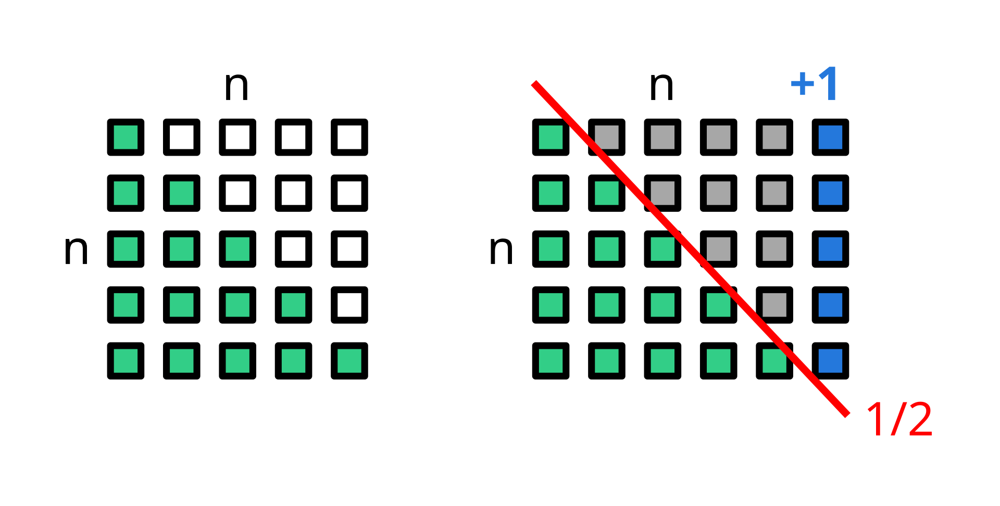

- **Laufzeit: O(1)** (Konstante Zeit, da nur eine Berechnung)
- **Kein Loop oder Rekursion nötig** – direkte Formel!

<div class="img-center img-600">

</div>

```pseudocode title="Pseudocode"
Funktion GaussSumme(n)
    Ergebnis := (n * (n + 1)) / 2
```
### Referenz

[**Wikipedia: Gaußsche Summenformel**](https://de.wikipedia.org/wiki/Gau%C3%9Fsche_Summenformel)
