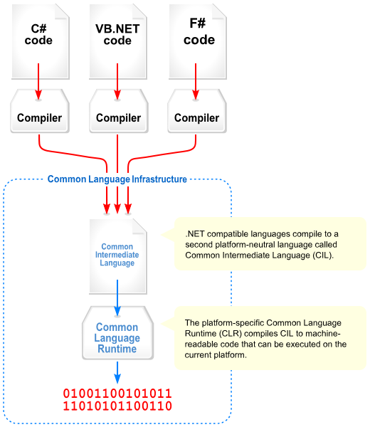

### Einführung in das .NET Framework

Das **.NET Framework** ist eine von Microsoft entwickelte Plattform zur Entwicklung und Ausführung von Anwendungen. Es bietet eine einheitliche Laufzeitumgebung, Bibliotheken und Werkzeuge für verschiedene Programmiersprachen wie C#, VB.NET und F#.

#### **1. Wichtige Kernkomponenten**

- **Common Intermediate Language (CIL)**  
    Der von .NET unterstützte Quellcode wird zunächst in eine zwischengeschaltete Sprache namens **CIL** (früher MSIL) übersetzt. Dieser Code ist unabhängig von der Zielplattform.
    
- **Just-In-Time Compiler (JIT)**  
    Bevor eine Anwendung ausgeführt wird, übersetzt der **JIT-Compiler** den CIL-Code zur Laufzeit in Maschinencode, der direkt auf der jeweiligen Hardware ausgeführt werden kann.
    
- **Common Language Runtime (CLR)**  
    Die **CLR** ist die Laufzeitumgebung von .NET. Sie verwaltet den Speicher, führt den JIT-Compiler aus und bietet Funktionen wie **Garbage Collection** und **Ausnahmebehandlung**.
    
- **.NET Framework Class Library (FCL)**  
    Eine Sammlung von vordefinierten Klassen und Methoden, die für häufige Aufgaben wie Dateizugriff, Netzwerkkommunikation und GUI-Entwicklung genutzt werden kann.

#### **2. Ablauf der Code-Ausführung in .NET**

1. Der Quellcode (z. B. in C#) wird mit dem Compiler (z. B. `csc`) in **CIL** übersetzt.
2. Der CIL-Code wird in einer **.dll** oder **.exe** gespeichert.
3. Bei der Ausführung übernimmt die **CLR** die Verwaltung.
4. Der **JIT-Compiler** wandelt den CIL-Code in nativen Maschinencode um.
5. Der optimierte Maschinencode wird von der CPU ausgeführt.

#### **3. Vorteile von .NET**

- **Plattformunabhängigkeit** (mit .NET Core/.NET 5+ auch für Linux & macOS).
- **Unterstützung mehrerer Programmiersprachen** (C#, F#, VB.NET).
- **Automatische Speicherverwaltung** dank **Garbage Collection**.
- **Große Standardbibliothek** für viele Anwendungsfälle.



### .NET-Pakete und ihre Funktionen

- **.NET SDK**: Das SDK ist das umfassendste Paket und enthält alles, was man für die Entwicklung von .NET-Anwendungen benötigt, einschließlich:

    - **.NET Runtime**: Die Runtime ist die Grundlage für die Ausführung von .NET-Anwendungen. Sie stellt die notwendigen Bibliotheken und Komponenten bereit, um .NET-Anwendungen auszuführen.
    - **.NET Compiler (Roslyn)**: Der Compiler wird verwendet, um den C#- oder F#-Code in ausführbaren Code zu übersetzen.
    - **.NET CLI (Command Line Interface)**: Die CLI ist ein Befehlszeilentool, mit dem man .NET-Projekte erstellen, kompilieren und ausführen kannst.
    - **.NET Templates**: Vorlagen für verschiedene Arten von .NET-Projekten (z.B. Konsolenanwendungen, Webanwendungen, Klassenbibliotheken).
    - **.NET Libraries**: Eine Sammlung von Bibliotheken, die verschiedene Funktionalitäten bereitstellen (z.B. Datenzugriff, Netzwerkkommunikation, Benutzeroberflächen).

- **.NET Runtime**: Die Runtime ist ausreichend, wenn man lediglich .NET-Anwendungen ausführen möchte. Für die Anwendungsentwicklung wird jedoch die SDK benötigt.

- **ASP.NET Core Runtime**: Für Webanwendungen mit ASP.NET Core, benötigt man zusätzlich die ASP.NET Core Runtime. Diese ist im .NET SDK enthalten, kann aber auch separat installiert werden.

### Setup unter Linux / Rider

[Install JetBrains Rider \| JetBrains Rider Documentation](https://www.jetbrains.com/help/rider/Installation_guide.html)

Pfad zum .NET CLI in Rider:
➡ **File** → **Settings** → **Build, Execution, Deployment** → **Toolset and Build**

```bash
which dotnet       # Pfad zum dotnet executable
dotnet --version   # verwendete dotnet version
```

```bash
# default -> /home/user/.dotnet/dotnet
export DOTNET_ROOT=/pfad/zu/riders/dotnet
export PATH=$DOTNET_ROOT:$PATH

# für dauerhafte Anwendung in ~/.bashrc bzw ~/.zshrc eintragen
echo 'export DOTNET_ROOT=/pfad/zu/riders/dotnet' >> ~/.bashrc
echo 'export PATH=$DOTNET_ROOT:$PATH' >> ~/.bashrc
source ~/.bashrc
```

### References
[en.wikipedia.org/wiki/.NET_Framework](https://en.wikipedia.org/wiki/.NET_Framework)  
[.NET \| Build. Test. Deploy.](https://dotnet.microsoft.com/en-us/)