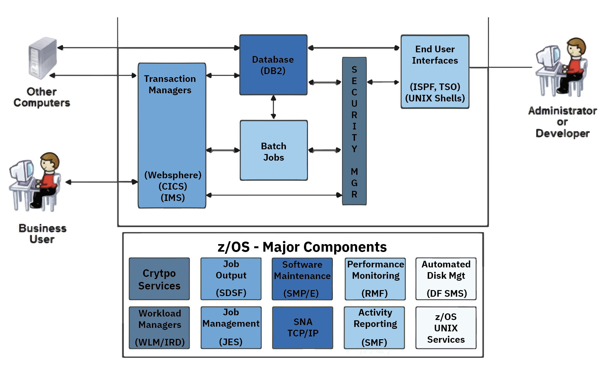

### Major Components



### TSO (= Time Sharing Option)

- **TSO** = interaktive Arbeitsumgebung unter z/OS.
- Vergleichbar mit einer **Login-Shell** unter Linux, aber speziell für Mainframe-Benutzer konzipiert.
- Macht den Mainframe **zeitgleich von mehreren Usern nutzbar** (Time Sharing).
#### **Eigenschaften von TSO**

**Multi-User-Fähigkeit**
- Viele Benutzer können gleichzeitig auf dem Mainframe arbeiten.
- Jeder bekommt seine eigene Session.

**Kommandoschnittstelle**
- Benutzer können TSO-Kommandos direkt eingeben (ähnlich wie Befehle in einer Unix-Shell).
- Beispiele: `ALLOCATE`, `LISTCAT`, `FREE`, `DELETE`.

**Integration mit ISPF**
- Typischerweise nutzt man TSO zusammen mit **ISPF (Interactive System Productivity Facility)**, einer Menü- und Editoroberfläche.
- Reines TSO ohne ISPF ist sehr textlastig und eher „nackt“.

**Interaktive und Batch-Verwendung**
- Man kann TSO-Kommandos interaktiv absetzen.
- Aber auch als **Batch-Job** laufen lassen (z. B. über `IKJEFT01`, das TSO Terminal Monitor Program).
#### ISPF (= Interactive System Productivity Facility)
- textbasierte Oberfläche auf IBM Mainframes
- Navigation, Dateiverwaltung, Editieren von Datasets, Job Submission (JCL)
#### ISHELL
- Oberfläche für die Unix System Services (USS)
- Erlaubt Zugriff auf das Unix Filesystem (HFS/zFS)
- startet Shells (sh, bash, ksh)
- Nutzung von Mainframe Resourcen im Unix Stil
## System Security

### Pervasive Encryption
Durchgängige Verschlüsselung: egal ob Daten "at Rest" sind oder "in Flight" (= im Netzwerk)

**Dataset Encryption**
- Jedes Dataset kann verschlüsselt werden (z. B. Sequential, PDS/PDSE, VSAM).
- z/OS verwaltet Schlüssel über den **ICSF (Integrated Cryptographic Service Facility)** und **RACF (Resource Access Control Facility)**.

**Filesystem Encryption**
- ZFS (z/OS File System) und HFS können verschlüsselt betrieben werden.

**Transport Encryption**
- TCP/IP-Kommunikation kann per AT-TLS automatisch verschlüsselt werden.

**Hardware-Unterstützung**
- Die IBM Z Prozessoren (ab z14) haben integrierte Kryptoprozessoren.
- Dadurch ist Verschlüsselung **leistungsfähig und kostengünstig**, weil sie direkt in der Hardware läuft.
### SAF (= System Authorization Facility)
SAF is a built-in feature of the operating system and provides tools for managing the system security functions. Users don't interface directly with SAF. Instead, z/OS components, such as IBM CICS®, which stands for Customer Information Control System or Time Sharing Option (TSO), can be enabled to communicate with SAF through a security manager component. These security managers, such as RACF (Resource Access Control Facility), contain the security rules used by the z/OS components.

### RACF
RACF stores IDs and passwords of users allowed to access the system. It also stores the names of objects, such as data sets, files, programs and so on, along with information about which users are allowed to access the protected objects for either read only or read/write.

An ID defined by RACF can be assigned to a person or process.  If a z/OS batch job or started task requests access to a protected resource, RACF will _allow_ or _deny_ access based upon the security rules defined by the RACF.  Access to protected objects frequently includes RACF multi-factor authentication, RACF digital certificates, and long complex RACF password strings.

## Datasets
- vergleichbar mit Ordnern
- enthält Member: jede Zeile in einem Member ist ein Record
- hierarchische Namensgebung: userid.project.data

### Sequential Dataset (PS – Physical Sequential Dataset)

- **Struktur**: Enthält eine lineare Abfolge von Datensätzen (Records). Jeder Record folgt einfach auf den nächsten.

- **Zugriff**:
    - Meist **sequentiell** – also man liest oder schreibt von Anfang bis Ende in der vorgegebenen Reihenfolge.
    - Direkter Zugriff ist in der Regel nicht vorgesehen.

- **Vergleich**: Entspricht am ehesten einer „einfachen Datei“ unter Linux/Windows (z. B. eine Textdatei).

---

### Partitioned Dataset (PDS / PDSE – Partitioned Dataset Extended)

- **Struktur**: Besteht aus einem **Directory** (Verzeichnis) und einer Sammlung von **Members**.
    - Directory = Inhaltsverzeichnis, das sagt, welche Member es gibt und wo sie liegen.
    - Jeder Member ist in sich wieder ein _sequentielles Dataset_, aber sie sind logisch im PDS gebündelt.

- **Zugriff**:
    - Du kannst gezielt einen Member auswählen, ohne die anderen durchlaufen zu müssen.
    - Zugriff auf die Inhalte eines Members erfolgt wieder sequentiell.

- **Vergleich**:
    - Ein PDS ist ungefähr wie ein ZIP-Archiv oder ein Ordner mit vielen Dateien, aber in einem einzigen physischen Dataset.        
    - Jeder Member ist wie eine eigene Datei im Ordner.

- **PDSE** (die modernere Variante) löst einige Limitierungen von klassischen PDS, z. B. feste Directory-Größe.

## Speicherorganisation auf dem Mainframe

### 1. Block

- Ein **Block** ist die kleinste **physisch geschriebene Einheit**.
- Enthält **einen oder mehrere Records (Datensätze)**.
- **Warum wichtig?** → Effizienz. Viele kleine Records werden in einem Block zusammengefasst, damit nicht jeder einzeln geschrieben/ gelesen wird.
    
    - Beispiel: 10 Records à 80 Bytes = 1 Block à 800 Bytes.

👉 Merksatz: _Block = „Paket von Records“_.

---

### 2. Track

- Ein **Track** ist eine „Spur“ auf der Festplatte.
- Enthält **mehrere Blöcke**.
- Größe hängt vom Plattentyp ab (klassisch ca. 56 KB pro Track bei älteren DASD).

👉 Merksatz: _Track = „Spur, auf der mehrere Blöcke liegen“_.

---

### 3. Zylinder

- Ein **Zylinder** besteht aus **allen Tracks auf derselben Höhe** über alle Plattenoberflächen.
- Wenn der Schreib-/Lesekopf im Zylinder bleibt, muss er sich nicht bewegen → schneller Zugriff.

👉 Merksatz: _Zylinder = „Bündel von übereinanderliegenden Tracks“_.

---

### 4. Praktische Sicht für JCL

Wenn du in JCL `SPACE=` angibst, sagst du **wie viel Platz du willst** – und zwar in diesen Einheiten:

- `SPACE=(TRK,(Primär,Sekundär))` → Reserviere Platz in **Tracks**
- `SPACE=(CYL,(Primär,Sekundär))` → Reserviere Platz in **Zylindern**
- `SPACE=(BLK,(Primär,Sekundär))` → Reserviere Platz in **Blöcken** (selten direkt benutzt, eher für kleine Dateien)

Beispiel:

```jcl
SPACE=(CYL,(2,1))
```

- Startgröße: 2 Zylinder
- Wenn mehr gebraucht wird → jeweils 1 weiterer Zylinder

---

# ⚡ Praxistipps

- **Für kleine Dateien** (z. B. Testausgabe): lieber `TRK` → spart Platz.
- **Für größere Dateien** (z. B. Batch-Reports): `CYL` → weniger Verwaltungsoverhead.
- **Blöcke** wählst du nicht direkt im SPACE, sondern über **BLKSIZE im DCB**.

👉 Denk also so:

- **SPACE = „Wie viel Festplatte reserviere ich?“**
- **DCB/BLKSIZE = „Wie groß sind die Pakete, in denen ich speichere?“**