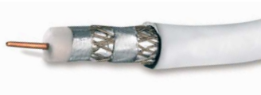
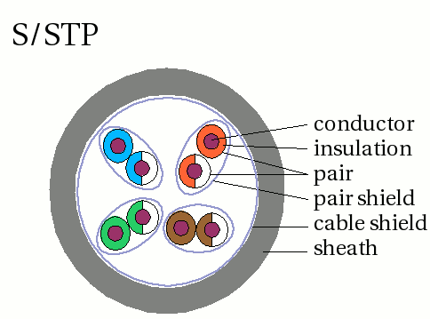

## Übertragungsmedien

Die Entscheidung für ein Übertragungsmedium hängt vor allem von dem Einsatzgebiet ab. In lokalen Netzen (LAN) werden vorzugsweise leitergebundene Medien wie verdrillte Kabel (TP: twisted pair), Koaxialkabel (Koax) oder Lichtwellenleiter (LWL) eingesetzt. Aufgrund der Störanfälligkeit werden Koaxialkabel bei modernen Netzwerkinstallationen immer seltener verwendet. Bei schwierigen Installationsverhältnissen oder notwendiger Mobilität der Arbeitsplätze finden auch lokale Funknetze mit begrenzter Reichweite (Wireless LAN, Bluetooth) ihren Einsatz. In weit reichenden Netzen (MAN, WAN, GAN) werden Lichtwellenleiterverbindungen sowie Funkverbindungen über Richtfunk oder Satellitenfunk verwendet.

Standards-Organisationen (TIA, EIA, IEEE). Wichtigster Standard: TIA/EIA-568

## Network Devices

| **Gerät**               | **OSI-Schicht**                                    | **Funktion**                                                                              |
|-------------------------|----------------------------------------------------|-------------------------------------------------------------------------------------------|
| **Netzwerkkarte (NIC)** | Schicht 1 (Physikalisch) und Schicht 2 (Sicherung) | Wandelt digitale Daten in elektrische/optische Signale um; MAC-Adresse verwalten          |
| **Repeater**            | Schicht 1 (Physikalisch)                           | Verstärkt elektrische Signale zur Verlängerung der Übertragungsstrecke                    |
| **Hub**                 | Schicht 1 (Physikalisch)                           | Leitet eingehende Daten an alle Ports weiter (Broadcast)                                  |
| **Bridge**              | Schicht 2 (Sicherung)                              | Trennt Netzwerke in Segmente, filtert Daten anhand MAC-Adressen                           |
| **Switch**              | Schicht 2 (Sicherung) (teilweise auch Schicht 3)   | Leitet Daten zielgerichtet anhand MAC-Adressen; manche Layer-3-Switches können IP-Routing |
| **Router**              | Schicht 3 (Netzwerk)                               | Verbindet Netzwerke, leitet Datenpakete anhand IP-Adressen weiter                         |
| **Modem**               | Schicht 1 (Physikalisch) bis Schicht 3 (Netzwerk)  | Modulation/Demodulation; Umwandlung analog ↔ digital; oft mit Routingfunktion             |
| **Access Point (WLAN)** | Schicht 2 (Sicherung)                              | Verbindet drahtlose Geräte mit einem drahtgebundenen Netzwerk (Bridge-Funktion)           |
| **Firewall**            | Schicht 3 (Netzwerk) bis Schicht 7 (Anwendung)     | Filtert Datenpakete nach Regeln; moderne Firewalls arbeiten tief bis in Anwendungsschicht |
| **Gateway**             | Alle Schichten (1–7)                               | Übersetzt Protokolle zwischen Netzwerken mit unterschiedlichen Architekturen              |

### Medienkonverter
Medienkonverter setzen Übertragungssignale zweier unterschiedlicher Medien auf der Schicht 1 des ISO/OSI Referenzmodells um. (rein physikalische Umsetzung)

### Netzwerkkarte (NIC)
Netzwerkkarten ermöglichen den Zugang zum Übertragungsmedium auf den Schichten 1 und 2 des ISO/OSI-Referenzmodells.(NIC = Network Interface Card)

- Umsetzung der vom Computerbus parallel empfangenen Daten in einen bitseriellen Datenstrom
- Mithilfe des Media Access Control-Protokolls (MAC-Protokoll) wird der Zugriff auf das Übertragungsmedium organisiert.

#### Mac-Adresse
- Die MAC-Adresse ist die hardwaremäßig festgelegte Adresse der Netzwerkkarte eines IT-Systems (Schicht 2).
- 48bit: 24bit Hersteller der Karte, 24bit Bezeichnung der Karte
- Hexadecimale Schreibweise

### Repeater
Ein Repeater regeneriert die Übertragungssignale (auf der physikalischen Schicht) in einem Netzwerk und dient der räumlichen Erweiterung eines Netzwerkes.

### Hub
Ein Hub verbindet als Sternpunktverteiler die angeschlossenen Systeme auf der Schicht 1. Er ist in seiner Funktion wie ein Bus zu betrachten. Aktive Hubs wirken durch eine Regeneration der Signalpegel gleichzeitig auch als Repeater und werden deshalb auch als Multiport-Repeater bezeichnet.

### Bridge
Ursprünglich wurden Bridges verwendet, um Netzwerke in kleinere Segmente zu unterteilen und den Datenverkehr zwischen diesen Segmenten zu kontrollieren. Moderne Netzwerktechnologien wie Switches und Router haben Bridges in vielen Bereichen weitgehend abgelöst, da sie effizienter und leistungsfähiger sind. Dennoch gibt es noch einige Situationen, in denen Bridges zum Einsatz kommen.

### Switch
Ein **Layer-2-Switch** arbeitet auf der **Sicherungsschicht (Data Link Layer)** des OSI-Modells und ist dafür verantwortlich, Datenrahmen (Frames) innerhalb eines lokalen Netzwerks (LAN) zwischen Geräten weiterzuleiten. Im Gegensatz zu einem Router, der auf Layer 3 (Netzwerkschicht) arbeitet und IP-Adressen verwendet, nutzt ein Layer-2-Switch die **MAC-Adressen** der Geräte, um den Datenverkehr zu steuern. 

#### MAC-Adressen-Tabelle (Forwarding Table)

- Ein Layer-2-Switch lernt die MAC-Adressen der angeschlossenen Geräte automatisch, indem er eingehende Frames analysiert. Jeder Netzwerkadapter (z. B. eine Netzwerkkarte) hat eine eindeutige MAC-Adresse.
- Wenn ein Gerät einen Frame an den Switch sendet, liest der Switch die Quell-MAC-Adresse des Frames und speichert sie zusammen mit dem dazugehörigen Port in einer Tabelle, die als **MAC-Adressen-Tabelle** oder **Forwarding Table** bezeichnet wird.
- Diese Tabelle wird kontinuierlich aktualisiert, sodass der Switch immer weiß, welche Geräte sich an welchen Ports befinden.

#### Unicast-Verkehr (gezielter Verkehr)

- Wenn der Switch ein Frame empfängt, liest er die Ziel-MAC-Adresse und sucht in seiner MAC-Adressen-Tabelle nach dem passenden Port.
- **Wenn die Ziel-MAC-Adresse bekannt ist**, leitet der Switch das Frame nur an den entsprechenden Port weiter, an den das Zielgerät angeschlossen ist.

#### Flooding (Wenn die Zieladresse unbekannt ist)

- Wenn der Switch ein Frame mit einer Ziel-MAC-Adresse empfängt, die **nicht in seiner Tabelle** gespeichert ist, führt er ein **Flooding** durch. Das bedeutet, dass er das Frame an alle Ports außer dem, von dem es gekommen ist, weiterleitet.
- Dies geschieht in der Hoffnung, dass das Zielgerät auf einen der anderen Ports antwortet. Wenn das Zielgerät antwortet, lernt der Switch die MAC-Adresse und kann zukünftige Frames gezielt an das Gerät senden.

#### Broadcast-Frames

- **Broadcast-Frames** sind Frames, die an alle Geräte im Netzwerk gesendet werden (z. B. ARP-Anfragen). Ein Layer-2-Switch leitet Broadcast-Frames an **alle Ports** weiter, weil sie keine spezifische Ziel-MAC-Adresse haben.

#### Full-Duplex-Modus

- Moderne Layer-2-Switches unterstützen den **Full-Duplex-Betrieb**, was bedeutet, dass Daten gleichzeitig in beide Richtungen zwischen einem Gerät und dem Switch gesendet und empfangen werden können. Dies verbessert die Bandbreitennutzung im Vergleich zu älteren Hub-basierten Netzwerken, die nur im Halbduplex-Modus arbeiteten.

#### Switching-Verfahren

Ein Layer-2-Switch verwendet verschiedene Methoden, um Frames weiterzuleiten:

- **Store-and-Forward**: Der Switch speichert das gesamte Frame, prüft es auf Fehler (z. B. durch eine CRC-Prüfung) und leitet es dann weiter. Diese Methode ist genauer, aber etwas langsamer.
- **Cut-Through**: Der Switch beginnt, das Frame weiterzuleiten, sobald die Ziel-MAC-Adresse gelesen wurde. Das erhöht die Geschwindigkeit, aber es gibt keine Fehlerüberprüfung.
- **Fragment-Free**: Eine Kombination der beiden oben genannten Methoden, bei der der Switch die ersten 64 Byte des Frames liest (genug, um festzustellen, ob ein Frame fehlerhaft ist), bevor er es weiterleitet.

#### Virtual LANs (VLANs)

- Viele Layer-2-Switches unterstützen die Konfiguration von **VLANs**. Ein VLAN ermöglicht es, logische Netzwerksegmente innerhalb desselben physischen Switches zu erstellen, um den Datenverkehr zu trennen und zu segmentieren.
- Jedes VLAN agiert wie ein separates Netzwerk, sodass der Datenverkehr zwischen VLANs nur über einen Layer-3-Switch (Router) geleitet werden kann.

#### MAC-Flapping und Loops

- In komplexen Netzwerken mit mehreren Switches können durch falsch konfigurierte Verbindungen **Loops** entstehen, bei denen sich Frames endlos im Netzwerk bewegen. Um dies zu verhindern, unterstützen viele Layer-2-Switches das **Spanning Tree Protocol (STP)**, das redundante Pfade erkennt und sicherstellt, dass nur eine aktive Verbindung zwischen zwei Netzwerkpunkten besteht.
- **MAC-Flapping** tritt auf, wenn ein Switch wiederholt verschiedene Ports für dieselbe MAC-Adresse in seiner Tabelle speichert, was auf instabile oder fehlerhafte Netzwerktopologien hindeutet.

#### Vorteile von Layer-2-Switches:

- **Effizienz**: Der Switch segmentiert das Netzwerk und reduziert unnötigen Datenverkehr, indem er nur die Frames an die entsprechenden Ports weiterleitet.
- **Hohe Geschwindigkeit**: Da ein Layer-2-Switch auf MAC-Adressen basiert, ist die Weiterleitung von Daten schneller als bei einem Router, der auf IP-Adressen und Routingtabellen basiert.
- **Vermeidung von Kollisionen**: Durch die Zuweisung dedizierter Pfade für den Datenverkehr werden Kollisionen vermieden, die in Hub-basierten Netzwerken auftreten könnten.
- **Skalierbarkeit**: Layer-2-Switches ermöglichen den Aufbau großer und effizienter Netzwerke, die sich leicht erweitern lassen.

#### Router

> Ein Router gehört adressmäßig zu mehreren Netzen und kann einen Paketaustausch zwischen diesen Netzen organisieren.

Router verbinden Netzwerke mit unterschiedlichen Topologien und Protokollen. Sie arbeiten auf den untersten drei Schichten des ISO/OSI-Referenzmodells. Die Grundfunktion ist die Wegfindung für Datenpakete in einem komplexen Netzwerk. Festgelegt wird der Weg vom Sender zum Empfänger durch Routing-Tabellen.

**Statisches Routing**: Der Router arbeitet mit vorher manuell hinterlegten Routing-Tabellen.  
**Dynamisches Routing**: Die Tabellen werden automatisch gebildet und aktualisiert. Der Weg des Paketes ist nicht festgelegt und wird erst zum Zeitpunkt des Versands ermittelt.

## Copper Cabling

**Dämpfung**: Die Dämpfung beschreibt die Abnahme eines Signalpegels bei einer Übertragung in dB.
**Übertragungsbandbreite**: Die Übertragungsbandbreite kennzeichnet den Frequenzbereich, in dem Signale mit einer festgelegten Amplitudendämpfung von 3 dB (entspricht einer Halbierung) übertragen werden können.
**Übertragungsgeschwindigkeit:** Die Übertragungsgeschwindigkeit gibt die Anzahl der übertragenen Bits pro Zeiteinheit an.

| Medium       | Übertragungsrate | Entfernung                                        |
|--------------|------------------|---------------------------------------------------|
| Koaxial      | 10 Mbit/s        | 185-500 m                                         |
| Twisted Pair | 10-500 Mbit/s    | 100 m (CAT 3) bis zu mehrere km (CAT 7)           |
| LWL          | 10 Gbit/s        | je nach Fasertyp 500m bis > 100km (Monomodefaser) |
| Funk         | 54 Mbit/s        | < 7 km                                            |

Der gesamte Übertragungsweg bestehend aus Übertragungsmedium, Steckern und Buchsen wird als „**Link**“ bezeichnet.

| **Kategorie** | **Einsatzgebiet / Geschwindigkeit**     | **Max. Frequenz** | **Max. Länge**           | **Typische Anwendung / Beispiel**                           |
|---------------|-----------------------------------------|-------------------|--------------------------|-------------------------------------------------------------|
| **Cat 3**     | Bis 10Mbps (Ethernet, analoges Telefon) | 16 MHz            | 100 m                    | Alte Telefonanlagen, 10BASE-T (veraltet)                    |
| **Cat 5**     | Bis 100Mbps (Fast Ethernet)             | 100 MHz           | 100 m                    | 100BASE-TX (veraltet)                                       |
| **Cat 5e**    | Bis 1Gbps (Gigabit Ethernet)            | 100 MHz           | 100 m                    | 1000BASE-T; heute noch häufig im Einsatz                    |
| **Cat 6**     | Bis 1Gbps (bis 55m auch 10Gbps)         | 250 MHz           | 100 m (GbE) 55 m (10GbE) | 1000BASE-T, 10GBASE-T in kurzen Distanzen                   |
| **Cat 6a**    | Bis 10Gbps                              | 500 MHz           | 100 m                    | 10GBASE-T in Rechenzentren und modernen Büros               |
| **Cat 7**     | Bis 10Gbps                              | 600 MHz           | 100 m                    | Abschirmung pro Adernpaar (S/FTP), z.B. in Industrie        |
| **Cat 7a**    | Bis 10–40Gbps (theoretisch)             | 1000 MHz          | 100 m                    | Selten verwendet; vorbereitet für 40GBASE-T (experimentell) |
| **Cat 8**     | Bis 25/40Gbps                           | 2000 MHz          | 30 m                     | Rechenzentren; 25GBASE-T, 40GBASE-T                         |

### Koaxialkabel
Koaxialkabel gehören zu der Kategorie der asymmetrischen Leiter. Sie bestehen aus einem Innenleiter, dem Dielektrikum (einer elektrischen Isolierschicht), einer äußeren metallischen Schirmung und einem Kunststoffaußenmantel. Sie ermöglichen eine Übertragungsgeschwindigkeit bis zu mehreren Gbit/s. In der Vergangenheit wurden einfache Netze (z. B. Cheapernet: 10 Mbit/s) kostengünstig mit Koaxialkabeln verbunden.

**Asymmetrische Leiter**
Bei asymmetrischen Leitern hat das Leitungspaar einen ungleichen Aufbau. Bei symmetrischen Leitungen sind Hin- und Rückleitung identisch aufgebaut.

- **Simplex:**
    - Daten können nur in eine Richtung übertragen werden.
    - Beispiel: Eine Fernbedienung sendet Signale an einen Fernseher, aber der Fernseher kann keine Daten zurück zur Fernbedienung senden.
- **Halb-Duplex:**
    - Daten können in beide Richtungen übertragen werden, jedoch nicht gleichzeitig.
    - Sender und Empfänger wechseln sich ab.
    - Beispiel: Ein Walkie-Talkie. Wenn eine Person spricht, kann die andere nicht gleichzeitig sprechen.
- **Voll-Duplex:**
    - Daten können in beide Richtungen gleichzeitig übertragen werden.
    - Beispiel: Ein Telefonat. Du kannst sprechen und gleichzeitig hören, was dein Gesprächspartner sagt.

**Asymmetrische Verbindungen:** In einigen Fällen kann die Übertragungsrate in eine Richtung höher sein als in die andere (z.B. bei Internetverbindungen, wo das Herunterladen oft schneller ist als das Hochladen).

### Twisted-Pair-Kabel
Als Twisted-Pair-Kabel bezeichnet man alle gängigen Varianten symmetrischer Leiter, die mit einer bestimmten Häufigkeit gegeneinander verdrillt sind (Schlaglänge). Durch die Schläge lassen sich Störungen in der Übertragung vermindern. Zusätzlich zu dieser Maßnahme kann eine Schirmung der gesamten Leitung gegen Störeinflüsse von außen, aber auch gegen Abstrahlung nach außen erfolgen.

Die einfachste Variante verdrillter Leitungen sind Telefonleitungen. Bei geschirmten Leitungen spricht man von Shielded-Twisted-Pair (STP), bei ungeschirmten Leitungen von Unshielded-Twisted-Pair (UTP). Besonders leistungsfähige Leitungsvarianten sind Screened-Shielded-Twisted-Pair-Kabel (S-STP), die eine weitere Abschirmung aufweisen und somit hohe Übertragungsfrequenzen ermöglichen (CAT6, CAT7). Typischerweise erfolgt der Anschluss über RJ-45-Stecker.

**UTP** = unshielded twisted Pair  
**STP** = shielded twisted Pair  
**S-STP** = screened shielded twisted Pair  

UTP ist das am häufigsten verwendete Kabel.

#### Straight-through Cables
Der gebräuchlichste Netzwerkkabeltyp. Er wird üblicherweise verwendet, um einen Host mit einem Switch und einen Switch mit einem Router zu verbinden.
#### Crossover Cables
Ein Kabel zum Verbinden ähnlicher Geräte. Beispielsweise zum Verbinden eines Switches mit einem Switch, eines Hosts mit einem Host oder eines Routers mit einem Router. Crossover-Kabel gelten jedoch mittlerweile als veraltet, da Netzwerkkarten mithilfe von Auto-MDIX (Medium-Dependent Interface Crossover) den Kabeltyp automatisch erkennen und die interne Verbindung herstellen.

## Fiber-Optic Cabling

#### Lichtwellenleiter
Die Übertragung von Daten über Lichtwellenleiter (LWL) setzt sich immer mehr durch. Dabei wird moduliertes Licht über eine Glas- oder Kunststofffaser übertragen. Die Übertragungskapazität von Lichtwellenleitern kann mehrere Gbit/s betragen.

Lichtwellenleiter können lösbar oder nichtlösbar miteinander verbunden werden. Lösbare Verbindungen sind Steckverbindungen, die zum Teil in „Crimp-Technik“ durch spezielles Verpressen und Polieren der Faserenden einfach hergestellt werden können.

Nichtlösbare Verbindungen werden durch Spleißen hergestellt. Hier wird nach Fusionsspleiß („Verschweißen“ der Faserenden) und Klebespleiß (Verkleben der Faserenden) unterschieden.

**Vorteile:**
- leicht, flexibel, zugfest, problemlose Verlegung
- gutes Preis-Leistungsverhältnis bei größeren Übertragungsstrecken, hohe Materialverfügbarkeit
- große Bandbreite, kleine Signaldämpfung
- hohe Störsicherheit, hohe Abhörsicherheit
- blitzschutz, keine Funkenbildung, chemisch und thermisch stabil, geringe Alterung

| **Typ**                        | **Kerndurchmesser** | **Lichtausbreitung**             | **Wellenlänge**   | **Reichweite**                  | **Typische Anwendungen**                  |
|--------------------------------|---------------------|----------------------------------|-------------------|---------------------------------|-------------------------------------------|
| **Monomode (Singlemode, SMF)** | 8–10 µm             | Nur ein Lichtmodus (geradlinig)  | 1310 nm / 1550 nm | bis >100 km (mit Verstärkern)   | Backbone, Fernverbindungen, Rechenzentren |
| **Multimode (MMF)**            | 50 oder 62,5 µm     | Mehrere Lichtmoden (Reflexionen) | 850 nm / 1300 nm  | bis max. 2km (je nach Standard) | Gebäude- oder Campusverkabelung           |

#### Monomode (Singlemode)
- Nur ein Lichtstrahl wird übertragen → keine Modendispersion
- Sehr geringe Dämpfung & hohe Reichweite
- Hoher Preis für Transceiver/Verarbeitung (Laser nötig)

Verwendete Lichtquelle: Laser  
Vorteil: ideal für lange Strecken (>10km) und sehr hohe Datenraten

#### Multimode
- Mehrere Lichtstrahlen werden gleichzeitig übertragen → Modendispersion
- Höhere Dämpfung und begrenzte Reichweite
- Günstigere Komponenten (LED oder VCSEL als Lichtquelle)

Verwendete Lichtquelle: LED oder VCSEL

## Wireless Media

- **Wi-Fi (IEEE 802.11)** – Wireless-LAN-Technologie (WLAN), allgemein als Wi-Fi bezeichnet. WLAN verwendet ein konkurrenzbasiertes Protokoll namens Carrier Sense Multiple Access/Collision Avoidance *(CSMA/CA)*. Die WLAN-Netzwerkkarte muss vor dem Senden zunächst prüfen, ob der Funkkanal frei ist. Sendet ein anderes WLAN-Gerät, muss die Netzwerkkarte warten, bis der Kanal frei ist. Wi-Fi ist eine Marke der Wi-Fi Alliance. Wi-Fi wird mit zertifizierten WLAN-Geräten nach IEEE 802.11-Standard verwendet.
- **Bluetooth (IEEE 802.15)** – Dies ist ein Standard für drahtlose persönliche Netzwerke (WPAN), allgemein als „Bluetooth“ bekannt. Es nutzt ein Gerätekopplungsverfahren für die Kommunikation über Entfernungen von 1 bis 100 Metern.
- **WiMAX (IEEE 802:16)** – Dieser allgemein als Worldwide Interoperability for Microware Access (WiMAX) bekannte Mobilfunkstandard nutzt eine Punkt-zu-Mehrpunkt-Topologie für drahtlosen Breitbandzugang.
- **Zigbee (IEEE 802.15.4)** – Zigbee ist eine Spezifikation für Kommunikation mit niedriger Datenrate und geringem Stromverbrauch. Sie ist für Anwendungen vorgesehen, die kurze Reichweite, niedrige Datenraten und eine lange Batterielaufzeit erfordern. Zigbee wird typischerweise in industriellen Umgebungen und im Internet der Dinge (IoT) eingesetzt, beispielsweise für drahtlose Lichtschalter und die Datenerfassung medizinischer Geräte.