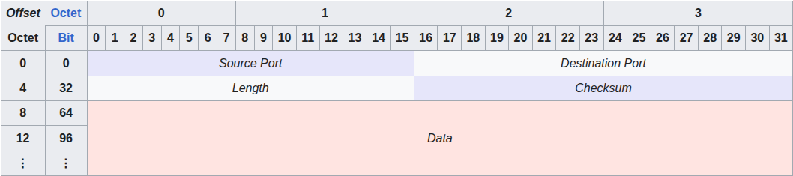
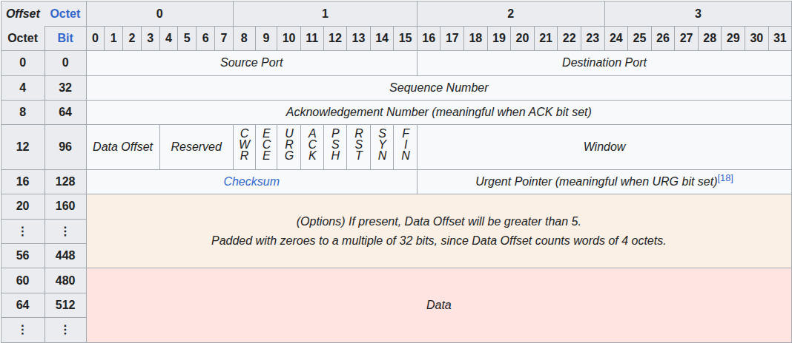

## Protokolle des Transportsystems

Innerhalb der TCP/IP-Protokollfamilie existieren die beiden Protokolle UDP und TCP als mögliche Vertreter der Transportschicht. UDP ist verbindungslos während TCP im Gegensatz dazu eine verbindungsorientierte Kommunikation darstellt.

Eine **verbindungsorientierte Kommunikation** ist durch das Vorhandensein eines Kommunikationskanals gekennzeichnet. Es wird überprüft, ob die Datenpakete unbeschädigt und in der richtigen Reihenfolge beim Empfänger eintreffen. Eine verbindungsorientierte Kommunikation wird häufig auch als leitungsvermittelte Kommunikation bezeichnet. (bsp. Telefon)

Bei einer **verbindungslosen Kommunikation** existiert kein Kommunikationskanal zwischen Sender und Empfänger. Der Sender sendet seine Nachrichten ohne sicher zu sein, ob der Empfänger überhaupt existiert bzw. die Datenpakte ordnungsgemäß dort ankommen. Eine verbindungslose Kommunikation wird häufig auch als paketvermittelte Kommunikation bezeichnet. (bsp. Post)

### Merkmale TCP und UDP

| TCP                                       | UDP                              |
|-------------------------------------------|----------------------------------|
| verbindungsorientiert                     | verbindungslos                   |
| zuverlässig                               | unzuverlässig                    |
| Unterteilung in Segmente                  | Unterteilung in Datagramme       |
| Reihenfolge der Segmente wird eingehalten | Reihenfolge wird nicht überprüft |
| sendet nicht empfangene Daten erneut      | verwendet keine Flusskontrolle   |
| langer Header (20-60 Byte)                | kurzer Header (8 Byte)           |

## User Datagram Protocol (UDP)

Da das User Datagram Protocol1 (UDP, RFC 768) ein verbindungsloses Protokoll ist, gewährleistet es nicht das ordnungsgemäße Erreichen der Datenpakete beim Empfänger. Es übernimmt auch keine Garantie für die korrekte Reihenfolge der Pakete. So kann es z.B. vorkommen, dass zwei nacheinander versendete Datenpakete in Abhängigkeit des momentanen Verkehrsaufkommens unterschiedliche Wege im Internet verwenden. Das zweite Datenpaket könnte somit vor dem ersten beim Empfänger eintreffen. Da UDP hier im Gegensatz zu TCP keinerlei Schutzmechanismen vorsieht, bezeichnet man UDP auch als unsicheres Protokoll. Die maximale Länge eines UDP-Datagramms beträgt 65 535 Byte.

## Transport Control Protocol (TCP)

Die Hauptaufgabe des Transport Control Protocol besteht in der Bereitstellung eines **zuverlässigen Transportes** von Daten durch das Netzwerk. Zuverlässige Übertragung bedeutet, dass die von einem Rechner verschickten Datenpakete entweder beim Empfänger eintreffen oder der Sender anderenfalls eine **Fehlermeldung** erhält. Ein Paket wird so lange immer wieder gesendet, bis der Empfänger den Empfang quittiert hat.

TCP unterstützt die Funktionen der Transportschicht und stellt vor der Datenübertragung eine gesicherte Verbindung zwischen den beteiligten Stationen her.

TCP ist **verbindungsorientiert**, d. h. es muss gewährleistet sein, dass die Datenpakete in genau derselben Reihenfolge beim Empfänger eintreffen, wie sie vom Sender verschickt wurden. Dies geschieht bei TCP über Sequenznummern. Jedes gesendete Paket erhält hierbei eine Nummer, die in Abhängigkeit der Reihenfolge des Sendens vergeben wird. Auf der Empfängerseite werden die Pakete dann entsprechend ihrer Nummern wieder zusammengesetzt. Fehlt zwischendurch ein Datenpaket, wartet TCP solange, bis entweder das Paket eingetroffen ist oder eine maximale Wartezeit erreicht wird. Das Ablaufen dieser Wartezeit führt dann zur Übermittlung einer Fehlermeldung an den Sender. Diese Vorgehensweise dient bei TCP der Realisierung einer Flusskontrolle.

**Acknowledgement Number**  
Enthält die Sequenznummer, die als nächstes erwartet wird. Gewaehrleistet, das kein Segement verloren geht.

### Flags  
- **ACK** - mit der Acknowledgement Number wird die Datenübertragung von Segmenten über TCP bestätigt. Ack-Number ist nur gültig wenn Ack-Flag gesetzt ist.
- **SYN** - Wird in einem TCP-Segment gesetzt um eine Verbindung zu initiieren. Synchronisierung der Sequenznummer beim Verbindungsaufbau.
- **Reset**

Unter Flusskontrolle versteht man einen Mechanismus zur Steuerung des Nachrichtenflusses. Damit wird gewährleistet, dass ein Sender mit hoher Verarbeitungsgeschwindigkeit nicht mehr Daten übermittelt, als ein langsamerer Empfänger verarbeiten kann.

### TCP-Handshake 

Der TCP-Handshake (auch Three-Way-Handshake) ist ein Prozess zur Verbindungsaufnahme zwischen zwei Hosts über das Transmission Control Protocol (TCP). Er stellt sicher, dass beide Seiten bereit sind, Daten zu senden und zu empfangen, und dient zur Synchronisation von Sequenznummern.

**Ablauf des TCP-Handshakes**

**1. SYN – Verbindungsanfrage**  
Der Client sendet ein TCP-Segment an den Server mit:

- dem SYN-Flag gesetzt (Synchronize),
- einer Initial Sequence Number (ISN), z.B. x.

**Ziel**: Den Wunsch zur Verbindung signalisieren und die eigene Sequenznummer übermitteln.

**2. SYN-ACK – Verbindungsannahme**  
Der Server antwortet mit einem TCP-Segment, das:

- sowohl das SYN- als auch das ACK-Flag gesetzt hat,
- seine eigene Initial Sequence Number (ISN) y enthält,

und ein ACK für x+1 sendet.

**Ziel**: Den Verbindungswunsch akzeptieren und die eigene Sequenznummer mitteilen.

**3. ACK – Bestätigung**  
Der Client bestätigt die Sequenznummer des Servers mit:

- einem Segment, bei dem nur das ACK-Flag gesetzt ist,
- einem ACK für y+1.

**Ziel**: Die Verbindung ist nun vollständig aufgebaut.

### TCP-Paketformat
Die Dateneinheiten, die zwischen dem Sender und dem Empfänger ausgetauscht werden, heißen Segmente. Ein TCP-Segment besteht aus einem Protokollkopf (TCP-Header, Länge zwischen 20 und 60 Byte) und den Nutzdaten. Die maximale Segmentgröße von 65 535 Byte wird durch zwei Faktoren begrenzt:

1. Das Segment darf nur so groß sein, dass es noch von dem Protokoll der darunterliegenden Schicht (IP) aufgenommen werden kann.
2. Das Segment muss in die „Maximum Transfer Unit“ des jeweiligen Netzes passen.

Die **MTU** wird von der dem Netz zugrunde gelegten Technologie bestimmt. Bei Verwendung von Ethernet beträgt die MTU z. B. 1500 Oktett, bei ATM 4500 Oktett.

Die **maximale Segmentgröße (MSS)** ist ein Parameter im Optionsfeld des TCP-Headers. Er gibt die größte Datenmenge (in Bytes) an, die ein Computer oder Kommunikationsgerät in einem einzelnen TCP-Segment empfangen kann. Der TCP-Header oder der IP-Header werden dabei nicht mitgezählt (im Gegensatz beispielsweise zur MTU für IP-Datagramme). Das IP-Datagramm, das ein TCP-Segment enthält, kann in einem einzigen Paket abgeschlossen sein oder aus mehreren fragmentierten Teilen rekonstruiert werden; in jedem Fall gilt die MSS-Begrenzung für die Gesamtdatenmenge im endgültigen, rekonstruierten TCP-Segment.

## Ports

Mithilfe von Portnummern wird die Verbindung zu Diensten auf vernetzten Stationen hergestellt.

Ein Rechner bietet innerhalb eines Netzwerkes häufig mehrere Dienste an wie z. B. den Datenaustausch mit anderen Rechnern (FTP) und den Empfang von E-Mails (POP oder IMAP). Da der Rechner jedoch lediglich unter einer einzigen Adresse im Netz erreichbar ist, muss über eine zusätzliche Kennung deutlich gemacht werden, welcher dieser Dienste konkret angesprochen werden soll. Dieses erfolgt mit Hilfe von Portnummern, die jedem Dienst zugewiesen werden.

Bei den Portnummern handelt es sich um 16-Bit-Werte, also Zahlen zwischen 0 und 65535, die von der IANA (Internet Assigned Numbers Authority) festgelegt sind.

Der gesamte Portnummernbereich ist in drei Ebenen unterteilt:

- **Well-Known-Ports (Portnummern 0 bis 1023)**: Diese Portnummern sind für systemnahe Dienste reserviert, d. h. Dienste, die aus Sicherheitsgründen nur vom Systemadministrator gestartet werden dürfen. So kann z. B. Telnet (Portnummer 23) mit der Möglichkeit des Zugriffs auf den eigenen Rechner über das Netz nur vom Systemadministrator freigegeben werden.
- **Registered Ports (Portnummern 1024 bis 49151)**: Hiermit werden Dienste gekennzeichnet, die offiziell bei der IANA angemeldet wurden. Registered Ports sollten nicht für selbst entwickelte Anwendungen verwendet werden.
- **Private Ports (Portnummern 49152 bis 65535)**: Private Ports können für beliebige Dienste wie z. B. selbst entwickelte Applikationen verwendet werden.

### Well Known Ports
(0-1023)

| Port Number | Service name  | Transport protocol | Description                                                                                                                      |
|-------------|---------------|--------------------|----------------------------------------------------------------------------------------------------------------------------------|
| **7**       | Echo          | TCP, UDP           | Echo service                                                                                                                     |
| **20**      | FTP-data      | TCP, SCTP          | File Transfer Protocol data transfer                                                                                             |
| **21**      | FTP           | TCP, UDP, SCTP     | File Transfer Protocol (FTP) control connection                                                                                  |
| **22**      | SSH-SCP       | TCP, UDP, SCTP     | Secure Shell, secure logins, file transfers (scp, sftp), and port forwarding                                                     |
| **23**      | Telnet        | TCP                | Telnet protocol—unencrypted text communications                                                                                  |
| **25**      | SMTP          | TCP                | Simple Mail Transfer Protocol, used for email routing between mail servers                                                       |
| **53**      | DNS           | TCP, UDP           | Domain Name System name resolver                                                                                                 |
| **80**      | HTTP          | TCP, UDP, SCTP     | Hypertext Transfer Protocol (HTTP) uses TCP in versions 1.x and 2. HTTP/3 uses QUIC, a transport protocol on top of UDP          |
| **88**      | Kerberos      | TCP, UDP           | Network authentication system                                                                                                    |
| **110**     | POP3          | TCP                | Post Office Protocol, version 3 (POP3)                                                                                           |
| **139**     | NetBIOS-ssn   | TCP, UDP           | NetBIOS Session Service                                                                                                          |
| **143**     | IMAP4         | TCP, UDP           | Internet Message Access Protocol (IMAP), management of electronic mail messages on a server                                      |
| **443**     | HTTP over SSL | TCP, UDP, SCTP     | Hypertext Transfer Protocol Secure (HTTPS) uses TCP in versions 1.x and 2. HTTP/3 uses QUIC, a transport protocol on top of UDP. |

**Socket** = IP + Port