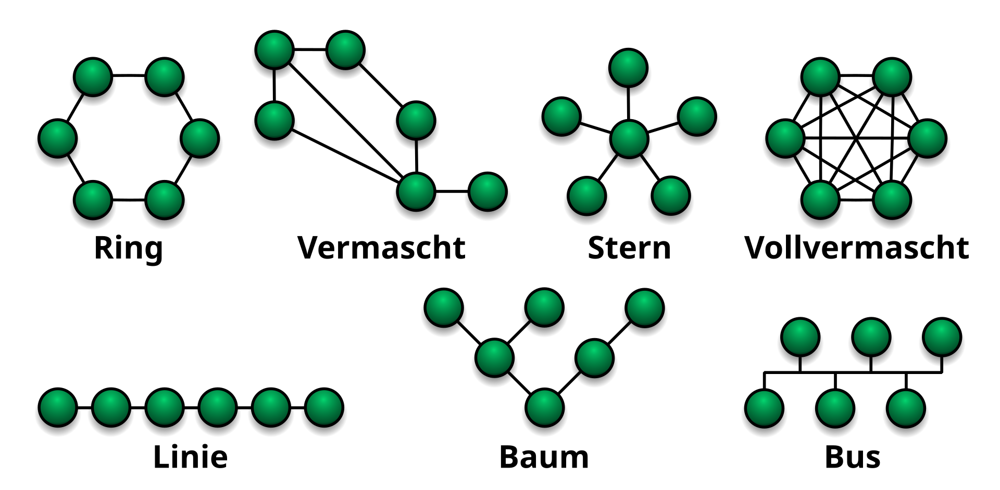

## Topolgies

**Gründe zur Vernetzung:**
- Resource-Sharing
- Prozessor-Sharing
- Software-Sharing
- Data-Sharing
- Informations-Austausch
- Sicherheitsverbund

### Physical and Logical Topolgies

Unter Netzwerktopologie versteht man die Art und Weise (Struktur), in der die einzelnen Netzwerkelemente verbunden werden.

Unter **physikalischer Topologie** versteht man die räumliche Verbindung von Netzwerkkomponenten.
Unter **logischer Topologie** versteht man die Organisation der Kommunikationswege zwischen den angeschlossenen Netzwerkstationen.

### Sterntopologie
Bei der Sterntopologie sind alle angeschlossenen Stationen zentral mit einem Sternpunkt verbunden. Neben der Vernetzung über einen Zentralrechner kann man auch die Verbindung über einen Hub oder Switch als physikalische Sterntopologie betrachten.

| Vorteile                    | Nachteile                                         |
|-----------------------------|---------------------------------------------------|
| hohe Übertragungssicherheit | hoher Aufwand in der Installation                 |
| hohe Bandbreite             | anfällig gg Störung oder Ausfall des Sternpunktes |

### Baumtopologie
Aufbauend auf der Sternstruktur lassen sich größere Netze in Form einer Baumtopologie entwickeln. Durch die Verwendung von Hubs, Switches, Routern, Gateways usw. können Netze entstehen, die sehr flexibel in ihrer Struktur sind.

### Vermaschte Topolgie
In einer vermaschten Topologie ist ein angeschlossenes System über mehrere physikalische Verbindungen mit anderen Systemen verbunden.

Anwendung findet diese Form der Vernetzung dann, wenn eine sehr schnelle, direkte und ausfallsichere Kommunikation zwischen den einzelnen Stationen erforderlich ist. Dies ist zum Beispiel in der Steuerung und Überwachung von Produktionsprozessen der Fall. Ein weiteres Anwendungsbeispiel ist die Erzeugung eines Rechnerverbundes, welcher nach außen hin als ein einziger Zentralrechner in Erscheinung tritt (z. B. als Rechnercluster).

| Vorteile                    | Nachteile                |
|-----------------------------|--------------------------|
| hohe Ausfallsicherheit      | hohe Installationskosten |
| hohe Übertragungssicherheit | hohe Komplexität         |
| hohe Bandbreite             |                          |

### Legacy LAN Topologies

Frühe Ethernet- und ältere Token-Ring-LAN-Technologien umfassten zwei weitere Topologietypen:

- **Bus** – Alle Endsysteme sind miteinander verkettet und an beiden Enden terminiert. Infrastrukturgeräte wie Switches sind zur Verbindung der Endgeräte nicht erforderlich. Ältere Ethernet-Netzwerke verwendeten aufgrund ihrer Kostengünstigkeit und einfachen Einrichtung häufig Bustopologien mit Koaxialkabeln.
- **Ring** – Endsysteme sind mit ihren jeweiligen Nachbarn zu einem Ring verbunden. Im Gegensatz zur Bustopologie muss der Ring nicht terminiert werden. Ältere Fiber Distributed Data Interface (FDDI)- und Token-Ring-Netzwerke verwendeten Ringtopologien.

### Räumliche Ausdehnung von Netzen

| Netz                      | Abk | Reichweite                                                                         |
|---------------------------|-----|------------------------------------------------------------------------------------|
| Personal Area Network     | PAN | häuslicher Bereich bis ca 100m                                                     |
| Local Area Netzwork       | LAN | auf einen Raum, ein Gebäude oder Firmengelände begrenzter Bereich bis mehrere 100m |
| Metropolitan Area Network | MAN | bis ca 100km                                                                       |
| Wide Area Network         | WAN | Land oder Kontinent bis mehrere 1000km                                             |
| Global Area Network       | GAN | global                                                                             |

## Netzwerk-Architektur

### Elemente von Netzwerken

#### Server
IT-Systeme, die Dienste und Funktionen anbieten, werden als Server bezeichnet.

- Kommunikationssteuerung
- Dateiverwaltung (File-Server)
- Verwaltung von Druckaufträgen (Print-Server)
- Verwaltung von Netzwerkzugriffen (Access-Server)

#### Client
IT-Systeme, die Dienste anfordern, werden als Client bezeichnet.

- Workstation (komplett ausgestattete Rechner)
- Thin Clients (Netzwerkcomputer ohne lokale Festplatten)

#### Terminal
Terminals sind Bedienkonsolen, die an besonders leistungsfähigen Servern, sogenannten TerminalServern, angeschlossen sind.

### Netzwerkarchitekturen
Die Organisation der Kommunikation zwischen mehreren Computern wird als Netzwerkarchitektur bezeichnet.

#### Peer-to-Peer-Netzwerk (P2P)
Werden zwei oder mehr Computer gleichberechtigt miteinander verbunden, so wird diese Architektur als Peer-to-Peer-Netzwerk1 bezeichnet (Abkürzung: P2P).

- alle Teilnehmer sind sowohl Client als auch Server
- birgt erhebliche Sicherheitsrisiken
- einfachste Variante: Verbindung zweier Rechner über Nullmodemkabel

| Vorteile                                 | Nachteile                   |
|------------------------------------------|-----------------------------|
| einfache Einrichtung                     | geringer Zugriffsschutz     |
| umfangreiche Nutzung der Systemresourcen | hoher Adminstrationsaufwand |
| einfache Erweiterbarkeit                 | hohe Störanfälligkeit       |
| geringe Kosten                           | komplexe Fehlersuche        |

#### Client-Server-Netzwerke
In Client-Server-Netzwerken bieten Server Dienste an, die von Clients angefordert werden können. Client-Server-Netzwerke sind streng hierarchisch aufgebaut.

| Vorteile                               | Nachteile                                |
|----------------------------------------|------------------------------------------|
| Zentrale Administration                | Hohe Kosten (Client- und Serverlizenzen) |
| Zentrales Angebot von Dienstleistungen | Aufwändige Einrichtung                   |
| Hoher Zugriffsschutz                   |                                          |
| Einfache Erweiterbarkeit               |                                          |

#### Weitere Netzwerkarchitekturen:
- Terminal-Server-Netzwerk
- Mittlere Datenbank
- Cluster (Ein Rechnercluster ist ein enger Verbund von Servern zu einem leistungsfähigen Gesamtsystem.)

## OSI-Schichtmodell
Das **ISO/OSI-Referenzmodell** (englisch Open Systems Interconnection model) ist ein Referenzmodell für Netzwerkprotokolle als Schichtenarchitektur. Es wird seit 1983 von der International Telecommunication Union (ITU) und seit 1984 auch von der International Organization for Standardization (ISO) als Standard veröffentlicht. Seine Entwicklung begann im Jahr 1977.  

Zweck des OSI-Modells ist es, Kommunikation über unterschiedlichste technische Systeme hinweg zu beschreiben und die Weiterentwicklung zu begünstigen. Dazu definiert dieses Modell sieben übereinanderliegende Schichten (englisch layers) mit jeweils eng begrenzten Aufgaben. Daher spricht man auch von OSI-Layern. In der gleichen Schicht mit klaren Schnittstellen definierte Netzwerkprotokolle sind einfach untereinander austauschbar, selbst wenn sie wie das Internet Protocol eine zentrale Funktion haben.

### Physical Layer

| Physical Layer         | Bitübertragungsschicht                                                                                                                                                                                                                                                                                                                                                                                                      |
|------------------------|:----------------------------------------------------------------------------------------------------------------------------------------------------------------------------------------------------------------------------------------------------------------------------------------------------------------------------------------------------------------------------------------------------------------------------|
| Hauptfunktion          | Binäre Signalübertragung                                                                                                                                                                                                                                                                                                                                                                                                    |
| Format                 | Bits / Physikalische Signale                                                                                                                                                                                                                                                                                                                                                                                                |
| Protokolle / Standards | DSL, ISDN, 1000Base-T, RJ45, USB, IEEE 802.3u                                                                                                                                                                                                                                                                                                                                                                               |
| Geräte                 | Hub, Repeater, Modem, Kabel                                                                                                                                                                                                                                                                                                                                                                                                 |
| Beschreibung           | In der Bitübertragungsschicht werden die mechanischen, elektrischen und funktionalen Eigenschaften einer Verbindung definiert. Dies betrifft z. B. die Festlegung des Übertragungsmediums, der Steckverbindungen und deren Belegung, der Signalpegel, der Signalcodierungen sowie des Auf- und Abbaus der physikalischen Verbindungen. Die einzelnen Bitsequenzen einer Nachricht werden in übertragbare Formate umgesetzt. |

### Data Link Layer

| Data Link Layer        | Sicherungsschicht                                                                                                                                                                                                 |
|------------------------|:------------------------------------------------------------------------------------------------------------------------------------------------------------------------------------------------------------------|
| Hauptfunktion          | Physikalische Adressierung                                                                                                                                                                                        |
| Format                 | Frames (Ethernet Frames!)                                                                                                                                                                                         |
| Protokolle / Standards | Ethernet (IEEE 802.3), WLAN (802.11), PPP, ARP, VLAN, CSMA/CD, CSMA/CA                                                                                                                                            |
| Geräte                 | Switch, Bridge, NIC                                                                                                                                                                                               |
| Beschreibung           | Durch die Sicherungsschicht wird der Zugriff auf das Übertragungsmedium organisiert und es werden aus den codierten Bitsequenzen Datenrahmen erzeugt. Übertragungsfehlererkennung: CRC (Cyclic Redundancy Check). |

### Network Layer

| Network Layer          | Netzwerkschicht                                                                                 |
|------------------------|:------------------------------------------------------------------------------------------------|
| Hauptfunktion          | Logische Adressierung                                                                           |
| Format                 | Packets                                                                                         |
| Protokolle / Standards | IP (IPv4/IPv6), ICMP, IGMP, IPSec                                                               |
| Geräte                 | Router                                                                                          |
| Beschreibung           | Die Organisation der Zustellung der Datenpakete wird durch die Vermittlungsschicht vorgenommen. |

### Transport Layer

| Transport Layer        | Transportschicht                                                                                               |
|------------------------|:---------------------------------------------------------------------------------------------------------------|
| Hauptfunktion          | End-to-end Verbindung, Fehlerkorrektur, Reihenfolge                                                            |
| Format                 | Segemente                                                                                                      |
| Protokolle / Standards | TCP, UDP, SSL, TSL                                                                                             |
| Geräte                 | -                                                                                                              |
| Beschreibung           | Das verbindende Element zwischen dem Anwendungssystem und dem Transportsystem stellt die Transportschicht dar. |

### Session Layer

| Session Layer          | Sitzungsschicht                                                                                                                                                                                                                                                 |
|------------------------|:----------------------------------------------------------------------------------------------------------------------------------------------------------------------------------------------------------------------------------------------------------------|
| Hauptfunktion          | Sitzungssteuerung, Dialogsteuerung                                                                                                                                                                                                                              |
| Format                 | -                                                                                                                                                                                                                                                               |
| Protokolle / Standards | NetBIOS, RPC, PPTP                                                                                                                                                                                                                                              |
| Geräte                 | -                                                                                                                                                                                                                                                               |
| Beschreibung           | Die Sitzungsschicht stellt dem Anwender auf der Befehlsebene die Steuerung der Kommunikation zwischen unterschiedlichen Systemen zur Verfügung. Dies umfasst z. B. die Zugangskontrolle, die Zugangsberechtigungen, die Fehlerbehandlung und den Datentransfer. |

### Presentation Layer

| Presentation Layer     | Darstellungsschicht                                                                                                                                                                                                            |
|------------------------|:-------------------------------------------------------------------------------------------------------------------------------------------------------------------------------------------------------------------------------|
| Hauptfunktion          | Datenformatierung, -verschlüsselung, -kompression                                                                                                                                                                              |
| Format                 | -                                                                                                                                                                                                                              |
| Protokolle / Standards | SSL/TLS, MIME, ASCII, JPEG, MP3                                                                                                                                                                                                |
| Geräte                 | -                                                                                                                                                                                                                              |
| Beschreibung           | In der Darstellungsschicht findet eine Codierung bzw. Decodierung der Datenformate für die Anwendungsschicht statt. Außerdem werden verschiedene Datenumwandlungen, Ver- und Entschlüsselungen und Datenprüfungen vorgenommen. |

### Application Layer

| Application Layer      | Anwendungsschicht                                                                                                                                                                                                                                                                                                                                         |
|------------------------|:----------------------------------------------------------------------------------------------------------------------------------------------------------------------------------------------------------------------------------------------------------------------------------------------------------------------------------------------------------|
| Hauptfunktion          | Schnittstelle zu Anwendungen                                                                                                                                                                                                                                                                                                                              |
| Format                 | -                                                                                                                                                                                                                                                                                                                                                         |
| Protokolle / Standards | HTTP, FTP, SMTP, DNS, POP3, IMAP                                                                                                                                                                                                                                                                                                                          |
| Geräte                 | PC, Server, Smartphone                                                                                                                                                                                                                                                                                                                                    |
| Beschreibung           | Die Anwendungsschicht beinhaltet keine spezielle Anwenderapplikation wie z. B. eine Tabellenkalkulation. Vielmehr wird durch diese Schicht die Verbindung zwischen dem Anwendungsprogramm und dem Netzwerk hergestellt. Dies geschieht beispielsweise bei der Ausführung entsprechender Befehle des Protokolls SMTP beim Senden und Empfangen von E-Mails |

## TCP/IP Modell
Ende der 1960er Jahre begann die Entwicklung mit einer Studie der **DARPA** (Defense Advanced Research Projects Agency), die dem Verteidigungsministerium der Vereinigten Staaten (DoD) untersteht, zur Entwicklung von Protokollen zur Datenkommunikation. Dabei entstand das **DoD-Schichtenmodell**, in dem die Aufgaben in **vier Schichten** unterteilt wurden. Dieses Modell ist Grundlage der Internetprotokollfamilie.

Kommunikation wird in Rechnernetzen durch Netzwerkprotokolle umgesetzt und in der Praxis in funktionale Schichten (layer) unterteilt. Für das Internet und die Internetprotokollfamilie ist dabei die Gliederung nach dem sogenannten TCP/IP-Referenzmodell, welches 4 aufeinander aufbauende Schichten beschreibt, maßgebend. Dieses ist auf die Internet-Protokolle zugeschnitten, die den Datenaustausch über die Grenzen lokaler Netze hinaus ermöglichen (dies sind vor allem TCP und IP). Hier werden weder der Zugriff auf ein Übertragungsmedium noch die Datenübertragungstechnik definiert. Vielmehr sind die Internet-Protokolle dafür zuständig, Datenpakete über mehrere Punkt-zu-Punkt-Verbindungen (Hops) weiterzuvermitteln und auf dieser Basis Verbindungen zwischen Netzteilnehmern über mehrere Hops herzustellen.

| **TCP/IP Model Layer** | **Description**                                                         |
|------------------------|:------------------------------------------------------------------------|
| **4 - Application**    | Represents data to the user, plus encoding and dialog control.          |
| **3 - Transport**      | Supports communication between various devices across diverse networks. |
| **2 - Internet**       | Determines the best path through the network.                           |
| **1 - Network Access** | Controls the hardware devices and media that make up the network.       |

## Standards

Offene Standards fördern Interoperabilität, Wettbewerb und Innovation. Sie garantieren zudem, dass die Produkte einzelner Unternehmen den Markt nicht monopolisieren oder einen unfairen Wettbewerbsvorteil erlangen können.

Standardisierungsorganisationen sind in der Regel herstellerneutrale, gemeinnützige Organisationen, die das Konzept offener Standards entwickeln und fördern. Sie sind wichtig für die Aufrechterhaltung eines offenen Internets mit frei zugänglichen Spezifikationen und Protokollen, die von jedem Anbieter implementiert werden können.

### Internetstandards

- **Internet Society (ISOC)** – Verantwortlich für die offene Entwicklung und Weiterentwicklung des Internets weltweit.
- **Internet Architecture Board (IAB)** – Verantwortlich für die allgemeine Verwaltung und Entwicklung von Internetstandards.
- **Internet Engineering Task Force (IETF)**– Entwickelt, aktualisiert und pflegt Internet- und TCP/IP-Technologien. Dies umfasst die Prozesse und Dokumente zur Entwicklung neuer Protokolle und zur Aktualisierung bestehender Protokolle, die als Request for Comments (RFC)-Dokumente bezeichnet werden.
- **Internet Research Task Force (IRTF)**– Konzentriert sich auf langfristige Forschung im Zusammenhang mit Internet- und TCP/IP-Protokollen, wie z. B. die Anti-Spam Research Group (ASRG), die Crypto Forum Research Group (CFRG) und die Peer-to-Peer Research Group (P2PRG).
- **Internet Corporation for Assigned Names and Numbers (ICANN)** – Die in den USA ansässige ICANN koordiniert die IP-Adresszuweisung, die Verwaltung von Domänennamen und die Zuweisung anderer in TCP/IP-Protokollen verwendeter Informationen.
- **Internet Assigned Numbers Authority (IANA)** – Verantwortlich für die Überwachung und Verwaltung der IP-Adresszuweisung, der Domänennamenverwaltung und der Protokollkennungen für die ICANN.

### Electronics and Communications Standards

- **Institute of Electrical and Electronics Engineers (IEEE, ausgesprochen „I-triple-E“)**
  Die Organisation für Elektrotechnik und Elektronik widmet sich der Förderung technologischer Innovationen und der Entwicklung von Standards in zahlreichen Branchen, darunter Energie, Gesundheitswesen, Telekommunikation und Netzwerke. Wichtige IEEE-Netzwerkstandards sind 802.3 Ethernet und 802.11 WLAN.
- **Electronic Industries Alliance (EIA)**
  Die Organisation ist vor allem für ihre Standards für elektrische Leitungen, Steckverbinder und 19-Zoll-Racks zur Montage von Netzwerkgeräten bekannt.
- **Telecommunications Industry Association (TIA)**
  Die Organisation entwickelt Kommunikationsstandards in verschiedenen Bereichen, darunter Funkgeräte, Mobilfunkmasten, VoIP-Geräte (Voice over IP), Satellitenkommunikation und mehr.
- **International Telecommunications Union-Telecommunication Standardization Sector (ITU-T)**
  Eine der größten und ältesten Organisationen für Kommunikationsstandards. Die ITU-T definiert Standards für Videokomprimierung, Internet Protocol Television (IPTV) und Breitbandkommunikation, beispielsweise Digital Subscriber Line (DSL).

### IEEE Standards

#### IEEE 802.3
In der Spezifikation IEEE 802.3 werden Systeme definiert, die das Zugriffsverfahren CSMA/CD verwenden. Deren eigentlicher Ursprung ist das „ALOHA1 “-System, das 1970 in Hawaii entwickelt wurde, um mehrere über die Hawaiianischen Inseln verstreute Rechner mittels Funk zu vernetzen. Die Firma XEROX entwickelte daraufhin 1976 ein System auf der Basis von ALOHA, das nicht Funk, sondern Leitungen zur Vernetzung verwendete. Auch wurde dort bereits ein vollständiges CSMA/CD-Zugriffsverfahren implementiert. Der Name dieses Systems war „Ethernet“.

#### Fast Ethernet
Die in der Spezifikation IEEE 802.3 festgelegte Übertragungsgeschwindigkeit ist für viele Anwendungen heute nicht mehr ausreichend. 1995 verabschiedete IEEE daher als Erweiterung den Standard 802.3u, der eine Übertragungsgeschwindigkeit von 100 Mbit/s erlaubt. Die in IEEE 802.3u enthaltenen Spezifikationen werden daher auch als „Fast Ethernet“ bezeichnet.

#### Gigabit Ethernet
Eine Weiterentwicklung des Fast Ethernet ist das Gigabit Ethernet. Hier werden Übertragungsraten bis 1 Gbit/s unterstützt. Die entsprechenden Standardisierungen sind in IEEE 802.3z und IEEE 802.3ab festgelegt. Vorhandene Fast-Ethernet-Infrastrukturen können bei Gigabit Ethernet beibehalten werden. Das gilt sowohl für die Verkabelung als auch für die im Netzwerk verwendeten Protokolle.

## Diagnostik

### Internet Control Message Protocol (ICMP)

Während die Protokolle TCP und IP im Wesentlichen der Übertragung von Nutzdaten dienen, wurde das auf der Schicht 3 arbeitende Internet Control Message Protocol entwickelt, um Störungen des Netzwerkverkehrs aufzuspüren. Wenn etwas Unerwartetes passiert, werden spezielle ICMP-Meldungen erzeugt und dann in IP-Datenpaketen zum Empfänger übertragen.

| ICMP Type | Message                     |
|-----------|-----------------------------|
| **0**     | **Echo reply**              |
| **3**     | **Destination unreachable** |
| 4         | Source quench               |
| 5         | Redirect                    |
| **8**     | **Echo**                    |
| 9         | Router advertisement        |
| 10        | Router selection            |
| 11        | Time exceeded               |
| 12        | Parameter problem           |
| 13        | Timestamp                   |
| 14        | Timestamp reply             |
| 15        | Information request         |
| 16        | Information reply           |
| 17        | Address mask request        |
| 18        | Address mask reply          |
| 30        | Traceroute                  |

### Command-Line Utilities

#### ping
Um festzustellen, ob ein bestimmter Rechner im Netz erreichbar ist, kann ein ICMP-Echo-Request von einem Benutzer mit Hilfe des Programms ping über die Kommandozeile erzeugt werden.

#### tracert (traceroute)
Die Programme tracert und traceroute dienen dem Erkunden von Routen zu einer Zielstation. Dazu senden sie ICMP-Echo-Requests mit verschiedenen TTL-Werten (TTL = Time to Live, Feld im IP-Header) an die Zielstation. Jeder Router verringert den TTL-Wert im IP-Header um 1, bevor er ein Datenpaket weiterleitet. Mit Hilfe von TTL lässt sich somit die Anzahl der passierten Router ermitteln. Erreicht der TTL-Zähler eines Datenpakets den Wert 0, teilt der betreffende Router der Quellstation mit, dass die Lebensdauer des Pakets abgelaufen ist (ICMP-Meldung „Time to live exceeded“).

tracert bzw. traceroute stellen die Route zur Zielstation fest, indem sie zunächst ein Echo-Datenpaket mit einem TTL-Wert von 1 senden. Der erste Router auf dem Weg zur Zielstation antwortet dann, dass die Lebensdauer des Datenpakets abgelaufen ist und meldet sich zusätzlich mit seinem Namen. Dann senden tracert bzw. traceroute ein zweites Echo-Datenpakets mit dem TTL-Wert 2. Nun meldet sich der zweite Router auf dem Weg zur Zielstation und nennt ebenfalls seinen Namen. Dieser Vorgang wird solange mit aufsteigenden TTL-Werten wiederholt, bis die Zielstation erreicht ist oder der max. mögliche TTL-Wert (255) erreicht wurde.

#### ipconfig (ifconfig)
Diese Programme dienen der Anzeige und Konfiguration von Netzwerkschnittstellen.

#### arp
Zum Auslesen und Ändern der ARP-Tabelle ist das Programm arp verfügbar.