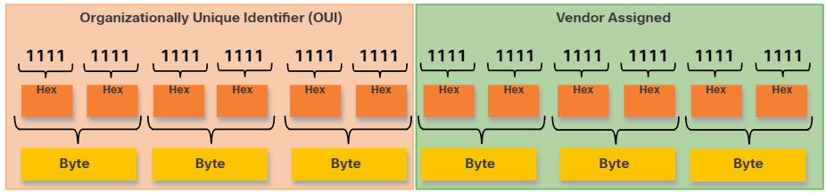
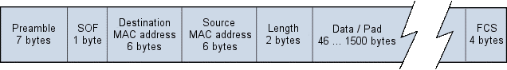

## MAC Addressen 

Manchmal wird die MAC-Adresse auch als burned-in address (BIA) bezeichnet, da sie im read-only-memory (ROM) der Netzwerkkarte fest kodiert ist. Das bedeutet, dass die Adresse dauerhaft im ROM-Chip kodiert ist. Beim Hochfahren des Computers kopiert die Netzwerkkarte ihre MAC-Adresse vom ROM in den RAM.

Der Prozess, mit dem ein Quellhost die Ziel-MAC-Adresse einer IPv4-Adresse ermittelt, wird als Address Resolution Protocol (ARP) bezeichnet. Der Prozess, mit dem ein Quellhost die Ziel-MAC-Adresse einer IPv6-Adresse ermittelt, wird als Neighbor Discovery (ND) bezeichnet.

### Ethernet-Broadcast

- Die Ziel-MAC-Adresse lautet hexadezimal FF-FF-FF-FF-FF-FF (binär 48 Einsen).  
- Alle Ethernet-Switch-Ports außer dem Eingangsport werden geflutet.  
- Kein forwarding über einen Router.  

DHCP nutzt Ethernet und IPv4-Broadcast. ARP-Anfragen nutzen keinen IPv4-Broadcast, die ARP-Nachricht wird jedoch als Ethernet-Broadcast gesendet.

### Ethernet-Multicast

Ein Ethernet-Multicast-Frame wird von einer Gruppe von Geräten im Ethernet-LAN empfangen und verarbeitet, die derselben Multicast-Gruppe angehören. Die Merkmale eines Ethernet-Multicasts sind:

- Die Ziel-MAC-Adresse lautet 01-00-5E, wenn die gekapselten Daten ein IPv4-Multicast-Paket sind, und die Ziel-MAC-Adresse lautet 33-33, wenn die gekapselten Daten ein IPv6-Multicast-Paket sind.
- Es gibt weitere reservierte Multicast-Ziel-MAC-Adressen für den Fall, dass die gekapselten Daten nicht IP-basiert sind, wie z. B. Spanning Tree Protocol (STP) und Link Layer Discovery Protocol (LLDP).
- Der Frame wird über alle Ethernet-Switch-Ports außer dem Eingangsport geflutet, sofern der Switch nicht für Multicast-Snooping konfiguriert ist.
- Der Frame wird nicht von einem Router weitergeleitet, sofern dieser nicht für die Weiterleitung von Multicast-Paketen konfiguriert ist.

Der Bereich der IPv4-Multicast-Adressen reicht von **224.0.0.0 bis 239.255.255.255**. Der Bereich der IPv6-Multicast-Adressen beginnt mit **ff00::/8**.

Routing-Protokolle und andere Netzwerkprotokolle verwenden Multicast-Adressierung. Auch Anwendungen wie Video- und Bildbearbeitungssoftware können Multicast-Adressierung verwenden, obwohl Multicast-Anwendungen seltener sind.

#### Switches und MAC-Adresstabellen

Switches verwenden eine der folgenden Weiterleitungsmethoden für die Datenweiterleitung zwischen Netzwerkports:

- **Store-and-Forward-Switching** – Diese Frame-Weiterleitungsmethode empfängt den gesamten Frame und berechnet den CRC. **CRC** verwendet eine mathematische Formel, die auf der Anzahl der Bits (Einsen) im Frame basiert, um festzustellen, ob der empfangene Frame einen Fehler enthält. Ist der CRC gültig, ermittelt der Switch die Zieladresse, die die ausgehende Schnittstelle bestimmt. Anschließend wird der Frame über den richtigen Port weitergeleitet.
- **Cut-Through-Switching** – Diese Frame-Weiterleitungsmethode leitet den Frame weiter, bevor er vollständig empfangen wurde. Mindestens die Zieladresse des Frames muss gelesen werden, bevor der Frame weitergeleitet werden kann.

## CSMA/CD
Ein typisches Zugriffsprotokoll in lokalen Netzen ist CSMA/CD, das z.B. beim Ethernet Verwendung findet. Dokumentiert ist dieses Verfahren in der Norm ISO 8802-2.

Der Name CSMA/CD (Carrier Sense Multiple Access/Collision Detection) setzt sich aus den in diesem Protokoll angewendeten Verfahren CS und CD zusammen. Die Bezeichnung MA drückt aus, dass alle Teilnehmer gleichberechtigt Zugriff auf das Übertragungsmedium haben.

Bevor eine Station Daten überträgt, hört sie zunächst das Übertragungsmedium ab („Carrier Sense“, CS). Ist das Übertragungsmedium bereits belegt, so wartet die Station bis es wieder frei wird.

Wenn zwei Stationen das Übertragungsmedium als frei erkennen und beide daraufhin gleichzeitig zu senden beginnen, entsteht eine Kollision. Diese wird jedoch sofort erkannt, da auch während einer Datenübertragung ständig geprüft wird, ob die Daten auf dem Übertragungsmedium mit den tatsächlich gesendeten Daten übereinstimmen („Collision Detection“, CD).

Im Falle einer Kollision wird die Datenübertragung von der sendenden Station sofort abgebrochen und ein spezielles Störungssignal gesendet („Jam-Signal“). Dieses Signal informiert die anderen Geräte in der Kollisionsdomäne über das Auftreten der Kollision. Erst nach Ablauf einer Wartezeit und bei freiem Übertragungsmedium kann der Sender einen neuen Übermittlungsversuch starten. Damit es nicht zwangsläufig zu einer erneuten Kollision kommt, wird die Wartezeit mit einer Zufallszahl erzeugt. Diese richtet sich u. a. danach, wie oft bereits Kollisionen festgestellt wurden. Bei vielen bisherigen Kollisionen (hohe Netzlast) wird die Wartezeit ebenfalls hoch sein, bei wenigen Kollisionen (niedrige Netzlast) fällt die Wartezeit entsprechend geringer aus. Mit dieser Vorgehensweise wird gewährleistet, dass ein Netz bei einer hohen Netzlast nicht zusätzlich durch viele Sendeversuche belastet wird.

| Vorteile                                   | Nachteile                                |
|:-------------------------------------------|:-----------------------------------------|
| reduzierte Anzahl an Kollisionen           | erhöhte Netzlast                         |
| gleichberechtigter Zugriff aller Stationen | Empfang einer Nachricht nicht garantiert |
| einfache Handhabung                        | Zugriffszeit nicht garantiert            |

## Unterschichten

- **Logical Link Control (LLC)** – Diese IEEE 802.2-Unterschicht kommuniziert zwischen der Netzwerksoftware der oberen Schichten und der Gerätehardware der unteren Schichten. Sie speichert Informationen im Frame, die das verwendete Netzwerkschichtprotokoll identifizieren. Diese Informationen ermöglichen es mehreren Layer-3-Protokollen wie IPv4 und IPv6, dieselbe Netzwerkschnittstelle und dasselbe Medium zu verwenden.
- **Media Access Control (MAC)** – Implementiert diese Unterschicht (IEEE 802.3, 802.11 oder 802.15) in Hardware. Sie ist für die Datenkapselung und die Medienzugriffskontrolle verantwortlich. Sie bietet die Adressierung der Datenverbindungsschicht und ist in verschiedene Technologien der physikalischen Schicht integriert.

Die MAC-Unterschicht sorgt für die Datenkapselung:

- **Frame-Begrenzung** – Der Framing-Prozess liefert wichtige Trennzeichen zur Identifizierung von Feldern innerhalb eines Frames. Diese Trennbits sorgen für die Synchronisierung zwischen Sende- und Empfangsknoten.
- **Adressierung** – Bietet Quell- und Zieladressierung für den Transport des Layer-2-Frames zwischen Geräten auf demselben gemeinsamen Medium.
- **Fehlererkennung** – Enthält einen Trailer zur Erkennung von Übertragungsfehlern.

Ein sendender Knoten erstellt eine logische Zusammenfassung des Frame-Inhalts, den sogenannten CRC-Wert (Cyclic Redundancy Check). Dieser Wert wird in das FCS-Feld (Frame Check Sequence) eingefügt, um den Frame-Inhalt darzustellen. Im Ethernet-Trailer ermöglicht die FCS dem empfangenden Knoten, festzustellen, ob im Frame Übertragungsfehler aufgetreten sind.

Zu den technischen Organisationen, die offene Standards und Protokolle für die Netzwerkzugriffsschicht (d. h. die OSI-Bitübertragungs- und Sicherungsschicht) definieren, gehören:

- Institute of Electrical and Electronics Engineers (IEEE)
- International Telecommunication Union (ITU)
- International Organization for Standardization (ISO)
- American National Standards Institute (ANSI)

| IEEE    | Standard                       |
|---------|--------------------------------|
| 802.2   | LLC Sublayer                   |
| 802.3   | MAC Sublayer                   |
| 802.3u  | Fast Ethernet                  |
| 802.3z  | Gigabit Ethernet over Fiber    |
| 802.3ab | Gigabit Ethernet over Copper   |
| 802.3ae | 10 Gigabit Ethernet over Fiber |

## Ethernet-Frames

| Field                                   | Description                                                                                                                                                                                                                                                                                                                                                                                                                                                                                                                                                                                                  |
|-----------------------------------------|:-------------------------------------------------------------------------------------------------------------------------------------------------------------------------------------------------------------------------------------------------------------------------------------------------------------------------------------------------------------------------------------------------------------------------------------------------------------------------------------------------------------------------------------------------------------------------------------------------------------|
| Preamble / Start Frame Delimiter Fields | Die Felder Präambel (7 Bytes) und Start Frame Delimiter (SFD), auch Start of Frame (1 Byte) genannt, dienen der Synchronisierung zwischen Sende- und Empfangsgeräten. Diese ersten acht Bytes des Frames dienen dazu, die Aufmerksamkeit der Empfangsknoten zu erregen. Im Wesentlichen signalisieren die ersten Bytes den Empfängern, sich auf den Empfang eines neuen Frames vorzubereiten.                                                                                                                                                                                                                |
| Destination MAC Address Field           | Dieses 6-Byte-Feld dient als Kennung für den Empfänger. Diese Adresse wird von Layer 2 verwendet, um Geräten zu helfen, festzustellen, ob ein Frame an sie adressiert ist. Die Adresse im Frame wird mit der MAC-Adresse des Geräts verglichen. Bei Übereinstimmung akzeptiert das Gerät den Frame. Es kann sich um eine Unicast-, Multicast- oder Broadcast-Adresse handeln.                                                                                                                                                                                                                                |
| Source MAC Address Field                | Dieses 6-Byte-Feld identifiziert die ursprüngliche Netzwerkkarte oder Schnittstelle des Frames.                                                                                                                                                                                                                                                                                                                                                                                                                                                                                                              |
| Type / Length                           | Dieses 2-Byte-Feld identifiziert das im Ethernet-Frame gekapselte Protokoll der oberen Schicht. Gängige Werte sind (hexadezimal) 0x800 für IPv4, 0x86DD für IPv6 und 0x806 für ARP. **Hinweis**: Dieses Feld wird möglicherweise auch als EtherType, Type oder Length bezeichnet.                                                                                                                                                                                                                                                                                                                            |
| Data Field                              | Dieses Feld (46–1500 Byte) enthält die gekapselten Daten einer höheren Schicht, d. h. eine generische Layer-3-PDU oder häufiger ein IPv4-Paket. Alle Frames müssen mindestens 64 Byte lang sein. Bei der Kapselung eines kleinen Pakets werden zusätzliche Bits, sogenannte Pads, verwendet, um die Frame-Größe auf diese Mindestgröße zu erhöhen.                                                                                                                                                                                                                                                           |
| Frame Check Sequence Field              | Das Frame Check Sequence (FCS)-Feld (4 Bytes) dient zur Fehlererkennung in einem Frame. Es verwendet eine zyklische Redundanzprüfung (CRC). Das sendende Gerät fügt die Ergebnisse der CRC in das FCS-Feld des Frames ein. Das empfangende Gerät empfängt den Frame und generiert eine CRC, um nach Fehlern zu suchen. Stimmen die Berechnungen überein, ist kein Fehler aufgetreten. Nicht übereinstimmende Berechnungen weisen auf eine Datenänderung hin; der Frame wird daher verworfen. Eine Datenänderung kann auf eine Störung der elektrischen Signale zurückzuführen sein, die die Bits darstellen. |

## ARP / NDP

### Address Resolution Protocol

ARP ermöglicht einem Rechner, die zu einer IP-Adresse zugehörige MAC-Adresse zu ermitteln. Auf der Schicht 2 werden zur Adressierung der einzelnen Systeme MAC-Adressen verwendet. Da deren Aufbau nicht für die Wegfindung der Schicht 3 geeignet ist, erfolgt auf der Vermittlungsschicht der Einsatz von IP-Adressen. Das hat jedoch zur Folge, dass ein Hilfsprotokoll notwendig ist, um den IP-Adressen die jeweiligen MAC-Adressen zuzuordnen. Diese Aufgabe übernimmt das Address Resolution Protocol der Schicht 2.

Wurde eine MAC-Adresse mithilfe von ARP ermittelt, so wird diese für einen eventuellen zukünftigen Datentransfer in einer Tabelle (ARP-Tabelle) gespeichert. Entsprechend muss ARP nur dann von dem zugehörigen Broadcast verwendet werden, wenn kein Eintrag in der Tabelle vorhanden ist.

### Neighbor Discovery Protocol

Das Neighbor Discovery Protocol (NDP) ist ein zentrales Protokoll im **IPv6-Netzwerkstack** und ersetzt Funktionen, die in IPv4 vom ARP, ICMP, IGMP und teilweise DHCP übernommen wurden. Es arbeitet auf der **Netzwerkschicht (OSI-Schicht 3)** und verwendet **ICMPv6-Nachrichten**, um wichtige Aufgaben durchzuführen: die Erkennung von Nachbarknoten (Neighbor Discovery), die Adressauflösung (wie ARP in IPv4), die Erkennung von doppelten Adressen (Duplicate Address Detection) sowie das Erkennen von Routern und Präfixen im lokalen Netzwerk. NDP ermöglicht damit eine weitgehend **autonome Konfiguration** von IPv6-Hosts und spielt eine wichtige Rolle bei der **Autokonfiguration** (SLAAC).

## WLAN

Ein WLAN-Router wird üblicherweise als WLAN-Zugangsgerät für kleine Unternehmen oder Privathaushalte eingesetzt. Der WLAN-Router kündigt seine WLAN-Dienste durch das Senden von Beacons mit seiner SSID (Shared Service Set Identifier) an. Geräte erkennen die SSID drahtlos und versuchen, sich mit ihr zu verbinden und zu authentifizieren, um auf das lokale Netzwerk und das Internet zuzugreifen.

### Autonome Access Points

Dies sind eigenständige Geräte, die über eine Befehlszeilenschnittstelle oder eine grafische Benutzeroberfläche (GUI) konfiguriert werden. Autonome APs sind sinnvoll, wenn in einem Unternehmen nur wenige APs benötigt werden. Ein Heimrouter ist ein Beispiel für einen autonomen AP, da die gesamte AP-Konfiguration auf dem Gerät gespeichert ist. Steigen die Anforderungen an die WLAN-Anbindung, werden weitere APs benötigt. Jeder AP arbeitet unabhängig von anderen APs und erfordert manuelle Konfiguration und Verwaltung. Bei vielen APs wäre dies unübersichtlich.

### Controller-basierte APs

Diese Geräte erfordern keine Erstkonfiguration und werden oft als Lightweight APs (LAPs) bezeichnet. LAPs nutzen das Lightweight Access Point Protocol (LWAPP) zur Kommunikation mit einem WLAN-Controller (WLC). Controller-basierte APs sind nützlich, wenn viele APs im Netzwerk benötigt werden. Werden weitere APs hinzugefügt, wird jeder AP automatisch vom WLC konfiguriert und verwaltet.

### CSMA/CA

WLANs sind Halbduplex-Konfigurationen mit gemeinsam genutzten Medien. Halbduplex bedeutet, dass immer nur ein Client gleichzeitig senden oder empfangen kann. Bei gemeinsam genutzten Medien können alle drahtlosen Clients auf demselben Funkkanal senden und empfangen. Dies führt zu einem Problem, da ein drahtloser Client während des Sendens nicht hören kann und somit eine Kollision nicht erkannt werden kann.

Um dieses Problem zu lösen, verwenden WLANs Carrier Sense Multiple Access mit Kollisionsvermeidung (CSMA/CA) als Methode, um zu bestimmen, wie und wann Daten im Netzwerk gesendet werden. Ein drahtloser Client führt folgende Aktionen aus:

1. Er überwacht den Kanal, um zu prüfen, ob er frei ist, d. h., er erkennt, dass sich aktuell kein anderer Datenverkehr auf dem Kanal befindet. Der Kanal wird auch als Träger bezeichnet.
2. Er sendet eine Sendeanforderung (RTS) an den AP, um dedizierten Zugriff auf das Netzwerk anzufordern.
3. Er empfängt eine Sendefreigabe (CTS) vom AP, die den Sendezugriff gewährt.
4. Empfängt der WLAN-Client keine CTS-Nachricht, wartet er eine zufällige Zeitspanne, bevor er den Prozess neu startet.
5. Nach dem Empfang der CTS-Nachricht sendet er die Daten.
6. Alle Übertragungen werden bestätigt. Erhält ein WLAN-Client keine Bestätigung, geht er von einer Kollision aus und startet den Prozess neu.