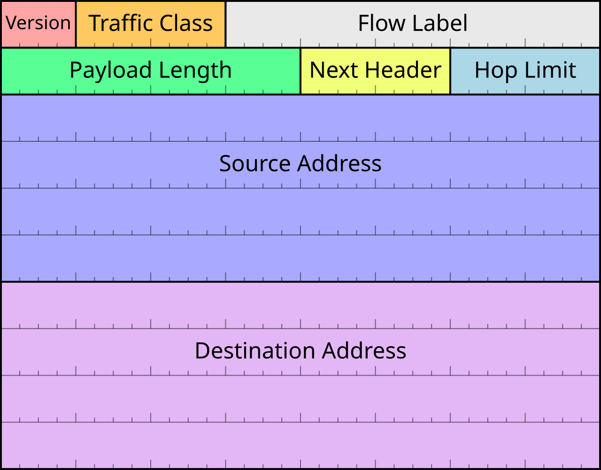
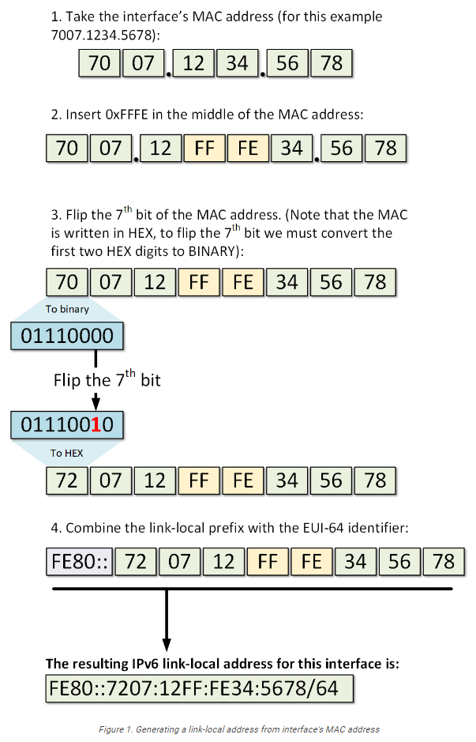

## Protokolle

### Internet Protocol (IP)

Während TCP und UDP der Schicht 4 des ISO/OSI-Referenzmodells angehören, arbeitet das Internet Protocol als untergeordnetes Protokoll auf der Vermittlungsschicht.

Bridges und Switches treffen Entscheidungen bzgl. der Weiterleitung von Daten anhand von MAC-Adressen. Router verwenden für diesen Zweck ein spezielles Adressierungsschema der Schicht 3. Die hierbei benutzten Adressen werden als IP-Adressen bezeichnet.

Verbindungsloses Protokoll ohne festen Kommunikationskanal oder Überprüfung der korrekten Reihenfolge. Datenpakte enthalten die vollständige IP-Quell und Zieladresse.

- **IPv4** – Internetprotokoll Version 4. Empfängt Nachrichtensegmente von der Transportschicht, verpackt Nachrichten in Pakete und adressiert Pakete für die End-to-End-Zustellung über ein Netzwerk. IPv4 verwendet eine 32-Bit-Adresse.
- **IPv6** – IP-Version 6. Ähnlich wie IPv4, verwendet jedoch eine 128-Bit-Adresse.
- **NAT** – Network Address Translation. Übersetzt IPv4-Adressen aus einem privaten Netzwerk in global eindeutige öffentliche IPv4-Adressen.

### ICMP

- **ICMPv4** – Internet Control Message Protocol für IPv4. Gibt Rückmeldungen vom Zielhost an den Quellhost über Fehler bei der Paketzustellung.
- **ICMPv6** – ICMP für IPv6. Ähnliche Funktionalität wie ICMPv4, wird jedoch für IPv6-Pakete verwendet.
- **ICMPv6 ND** – ICMPv6 Neighbor Discovery. Enthält vier Protokollnachrichten zur Adressauflösung und Erkennung doppelter Adressen.

### Routing-Protokolle

- **OSPF** – Open Shortest Path First. Link-State-Routing-Protokoll mit hierarchischem Design basierend auf Bereichen. OSPF ist ein offenes Standard-Internal-Routing-Protokoll.
- **EIGRP** – EIGRP – Enhanced Interior Gateway Routing Protocol. Ein von Cisco entwickeltes offenes Standard-Routing-Protokoll, das eine zusammengesetzte Metrik basierend auf Bandbreite, Verzögerung, Auslastung und Zuverlässigkeit verwendet.
- **BGP** – Border Gateway Protocol. Ein offenes Standard-External-Gateway-Routing-Protokoll, das zwischen Internetdienstanbietern (ISPs) verwendet wird. BGP wird auch häufig zwischen ISPs und ihren großen privaten Kunden zum Austausch von Routing-Informationen verwendet.

## IPv4


### Subnetzmaske

Die Subnetzmaske trennt Netzadresse und Rechneradresse. Subnetzmasken werden für die Einteilung der IP-Adressbereiche in Unternetze verwendet.Subnetzmasken können jedoch auch als „network prefix“ an die IP-Adresse angehängt werden. (CIDR-Notation)

Die niedrigste innerhalb eines Netzes zur Verfügung stehende IP-Adresse ist die Netzadresse. Die höchste innerhalb eines Netzes zur Verfügung stehende IP-Adresse ist die Broadcast-Adresse. Beide sind somit bereits vergeben und stehen für die Adressierung von Hosts nicht mehr zur Verfügung.

### Netzklassen

| Netzklasse | Adressbereich               | Netzmaske                            | Netze     | Hosts pro Netz |
|------------|-----------------------------|--------------------------------------|-----------|----------------|
| Klasse A   | 0.0.0.0 – 127.255.255.255   | 255.0.0.0                            | 128       | 16.777.214     |
| Klasse B   | 128.0.0.0 – 191.255.255.255 | 255.255.0.0                          | 16.384    | 65.534         |
| Klasse C   | 192.0.0.0 – 223.255.255.255 | 255.255.255.0                        | 2.097.152 | 254            |
| Klasse D   | 224.0.0.0 – 239.255.255.255 | Verwendung für Multicast-Anwendungen |           |                |
| Klasse E   | 240.0.0.0 – 255.255.255.255 | reserviert (für zukünftige Zwecke)   |           |                |

**Bit-weise Representation**
```
Class A
  0.  0.  0.  0 = 00000000.00000000.00000000.00000000
127.255.255.255 = 01111111.11111111.11111111.11111111
                  0nnnnnnn.HHHHHHHH.HHHHHHHH.HHHHHHHH
                  |-Netz-|-----------Host-----------|

Class B
128.  0.  0.  0 = 10000000.00000000.00000000.00000000
191.255.255.255 = 10111111.11111111.11111111.11111111
                  10nnnnnn.nnnnnnnn.HHHHHHHH.HHHHHHHH
                  |-------Netz-----|------Host------|
Class C
192.  0.  0.  0 = 11000000.00000000.00000000.00000000
223.255.255.255 = 11011111.11111111.11111111.11111111
                  110nnnnn.nnnnnnnn.nnnnnnnn.HHHHHHHH
                  |-----------Netz----------|-Host--|
Class D
224.  0.  0.  0 = 11100000.00000000.00000000.00000000
239.255.255.255 = 11101111.11111111.11111111.11111111
                  1110XXXX.XXXXXXXX.XXXXXXXX.XXXXXXXX
                  |------------Multicast------------|
Class E
240.  0.  0.  0 = 11110000.00000000.00000000.00000000
255.255.255.255 = 11111111.11111111.11111111.11111111
                  1111XXXX.XXXXXXXX.XXXXXXXX.XXXXXXXX
                  |------------Reserviert-----------|
```

#### CIDR (Classless Inter Domain Routing)
Zur effizienteren Ausnutzung von IPAdressräumen wird die klassenlose Adressbildung angewandt.

#### Adressvergabe
Soll eine Adressvergabe nach Netzklassen erfolgen, so stehen im Prinzip die oben aufgeführten Adressräume zur Verfügung. Sie werden weltweit einmalig durch autorisierte Stellen vergeben. Weltweit wird dies durch das **ICANN** organisiert. In der Bundesrepublik Deutschland erfüllt diese Aufgabe die **DeNIC GmbH**.

### Netzbereiche

#### Private Netzebereiche

| **CIDR**         | **Netzbereich**                 |
|:-----------------|:--------------------------------|
| `10.0.0.0/8`     | `10.0.0.0 - 10.255.255.255`     |
| `172.16.0.0/12`  | `172.16.0.0 - 172.31.255.255`   |
| `192.168.0.0/16` | `192.168.0.0 - 192.168.255.255` |

#### Andere Netzbereiche

| **Netzbereich**  | **CIDR**                        | **Beschreibung**                       | **Verwendung**                            |
|------------------|:--------------------------------|:---------------------------------------|:------------------------------------------|
| `0.0.0.0/8`      | `0.0.0.0 - 0.255.255.255`       | "This network" – aktuelle Netzreferenz | Nicht routbar, z.B. bei DHCP oder Routing |
| `127.0.0.0/8`    | `127.0.0.0 - 127.255.255.255`   | **Loopback (localhost)**               | Tests auf dem eigenen Host                |
| `169.254.0.0/16` | `169.254.0.0 - 169.254.255.255` | **Link-Local** (APIPA)                 | Automatische IP bei DHCP-Ausfall          |
| `224.0.0.0/4`    | `224.0.0.0 - 239.255.255.255`   | **Multicast**                          | IP-Multicast (Streaming, mDNS, etc.)      |
| `240.0.0.0/4`    | `240.0.0.0 - 255.255.255.254`   | **Reserviert (zukünftige Verwendung)** | Nicht routbar                             |

### Automatic Private IP Addressing (APIPA)
Bezieht sich auf eine im Microsoft Windows-Betriebssystem implementierte Funktion, die es Geräten ermöglicht, sich selbst automatisch IP-Adressen zuzuweisen, wenn sie keine IP-Adresse von einem DHCP-Server (Dynamic Host Configuration Protocol) erhalten können.

### IPv4 Header


| **Feld**               | **Beschreibung**                                                    |
|------------------------|:--------------------------------------------------------------------|
| **Version**            | IPv4 = `4`                                                          |
| **IHL**                | Internet Header Length (Anzahl 32-Bit-Wörter, min. = 5 → 20 Byte)   |
| **Type of Service**    | Diensttyp / Differentiated Services (QoS, DSCP, ECN)                |
| **Total Length**       | Gesamtlänge des IP-Pakets (inkl. Header + Daten), max. 65.535 Bytes |
| **Identification**     | Paketkennung für Fragmentierung                                     |
| **Flags**              | z.B. „Don’t Fragment (DF)“, „More Fragments (MF)“                   |
| **Fragment Offset**    | Position eines Fragments im Originalpaket                           |
| **TTL**                | Time To Live – maximale Anzahl von Routern (Hops)                   |
| **Protocol**           | Nächstes Protokoll (z.B. TCP = 6, UDP = 17, ICMP = 1)               |
| **Header Checksum**    | Fehlererkennung des Headers (nicht der Daten)                       |
| **Source IP**          | Absenderadresse                                                     |
| **Destination IP**     | Zieladresse                                                         |
| **Options** (optional) | Erweiterungen wie Security, Timestamps etc. (nur selten verwendet)  |

### DHCPv4

Anstatt eine statische IP-Adresse zu nutzen, kann der Rechner auch automatisch eine IP-Adresse von einem Server beziehen. Der Server muss den DHCP Dienst anbieten. Am Client ist einzustellen, ob er bei der Anmeldung nach einem vorhandenen DHCP-Server suchen soll oder ob er direkt von einem vorgegebenem DHCP-Server eine IP-Adresse beziehen soll.

## IPv6


### Kürzung von IPv6 Addressen

Der Einfachheit halber und übersichtlicher kann die Darstellung einer IPv6-Adresse nach folgenden Regeln verkürzt werden:

- Eine oder mehrere führende Nullen aus einer beliebigen Gruppe hexadezimaler Ziffern werden entfernt, üblicherweise alle führenden Nullen. Beispielsweise wird die Gruppe 0042 in 42 umgewandelt. Die Gruppe 0000 wird in 0 umgewandelt.
- Aufeinanderfolgende Nullenabschnitte werden durch zwei Doppelpunkte (::) ersetzt. Dieser darf nur einmal in einer Adresse verwendet werden, da eine mehrfache Verwendung die Adresse undefiniert machen würde. Ein doppelter Doppelpunkt sollte nicht verwendet werden, um einen ausgelassenen einzelnen Nullenabschnitt zu kennzeichnen.[40]: §4.2.2

**Ein Beispiel für die Anwendung dieser Regeln:**

Anfangsadresse: 2001:0db8:0000:0000:0000:ff00:0042:8329.  
Nach dem Entfernen aller führenden Nullen in jeder Gruppe: 2001:db8:0:0:0:ff00:42:8329.  
Nach dem Weglassen aufeinanderfolgender Nullabschnitte: 2001:db8::ff00:42:8329.  

### Wichtige Addressbereiche

| **Adresse / Bereich** | **CIDR** | **Bezeichnung**         | **Verwendung**                                |
|-----------------------|----------|-------------------------|-----------------------------------------------|
| `::/128`              | `/128`   | **Unspecified Address** | "Keine Adresse" (z.B. als Platzhalter)        |
| `::1/128`             | `/128`   | **Loopback Address**    | Kommunikation mit sich selbst                 |
| `2000::/3`            | `/3`     | **Global Unicast**      | Öffentlich routbare Adressen                  |
| `fe80::/10`           | `/10`    | **Link-Local**          | Lokale Verbindung (z.B. Router-Kommunikation) |
| `ff00::/8`            | `/8`     | **Multicast**           | Multicast-Adressen                            |

#### Link-Local Adress ipv4 vs ipv6

**Link-Local ipv4** = autoconfiguration when no DHCP-Server is available (eg Microsoft APIPA = **Automatic Private IP Addressing**)  
**Link-Local ipv6** = is required for every IPv6-enabled device to communicate locally  

### Global Unicast und Link-Local IPv6

- **Globale Unicast-Adresse (GUA)** – Diese Adresse ähnelt einer öffentlichen IPv4-Adresse. Es handelt sich um global eindeutige, über das Internet routbare Adressen. GUAs können statisch konfiguriert oder dynamisch zugewiesen werden.
- **Link-Local-Adresse (LLA)** – Diese Adresse ist für jedes IPv6-fähige Gerät erforderlich. LLAs dienen der Kommunikation mit anderen Geräten über denselben lokalen Link. Bei IPv6 bezeichnet der Begriff Link ein Subnetz. LLAs sind auf einen einzigen Link beschränkt. Ihre Eindeutigkeit muss nur auf diesem Link bestätigt werden, da sie nicht über diesen Link hinaus geroutet werden können. Anders ausgedrückt: Router leiten keine Pakete mit einer Link-Local-Quell- oder Zieladresse weiter.

In Internet Protocol Version 6 (IPv6) ist der Adressblock **fe80::/10** für die Link-Local-Unicast-Adressierung reserviert. (anm.: /10 betrifft die Address Range; eine spezifische Link-Local Adresse hat immer den Prefix /64)

### Unique Local Address (ULA)
**fc00::/7 - fdff::/7**

Die eindeutigen lokalen IPv6-Adressen ähneln teilweise den privaten RFC 1918-Adressen für IPv4, weisen jedoch wesentliche Unterschiede auf:

- Eindeutige lokale Adressen werden für die lokale Adressierung innerhalb eines Standorts oder zwischen einer begrenzten Anzahl von Standorten verwendet. (Anm.: verbundene private Subnetze)
- Eindeutige lokale Adressen können für Geräte verwendet werden, die nie auf ein anderes Netzwerk zugreifen müssen.
- Eindeutige lokale Adressen werden nicht global geroutet oder in eine globale IPv6-Adresse übersetzt.

**Hinweis:** Viele Standorte nutzen den privaten Charakter von RFC 1918-Adressen auch, um ihr Netzwerk vor potenziellen Sicherheitsrisiken zu schützen oder zu verbergen. Dies war jedoch nie der beabsichtigte Einsatzzweck dieser Technologien, und die IETF hat stets empfohlen, dass Standorte die entsprechenden Sicherheitsvorkehrungen auf ihren internetfähigen Routern treffen.

**Wikipedia**  
Im Dezember 1995 wurde der IPv6-Adressblock fec0::/10 für sitelocal Adressen reserviert, die innerhalb einer site für private IPv6-Netzwerke verwendet werden konnten. Eine unzureichende Definition des Begriffs „site“ führte jedoch zu Verwirrung hinsichtlich der geltenden Routing-Regeln.

Im September 2004 verwarf die Internet Engineering Task Force (IETF) die Definition dieses Adressbereichs und schlug Lösungen für die Probleme vor. Das damals geforderte Sonderverhalten für diesen Adresstyp wurde 2006 aufgehoben, und der Block wurde wieder auf reguläres globales Unicasting umgestellt.

Im Oktober 2005 reservierte die IETF den Adressblock _fc00::/7_ für die Verwendung in privaten IPv6-Netzwerken und definierte den zugehörigen Begriff **Unique Local Address**.

**Branchennutzung**  
Der ULA-Block ist im Kontext von Dienstanbietern und Inhaltsanbietern nützlich, da er die Infrastruktur isoliert und somit eine Gefährdung durch das Internet verhindert.

Ein Beispiel hierfür ist Amazon Web Services, das ULAs in seinem virtuellen privaten Cloud-Netzwerk verwendet. Insbesondere wird der Block fd00:ec2::/32 für lokale Dienste wie Zeitsynchronisierungsdienste oder DNS-Resolver verwendet.

### IPv6-Multicast

IPv6-Multicast-Adressen ähneln IPv4-Multicast-Adressen. Eine Multicast-Adresse dient zum Senden eines einzelnen Pakets an ein oder mehrere Ziele (Multicast-Gruppe). IPv6-Multicast-Adressen haben das Präfix **ff00::/8**.

**Hinweis:** Multicast-Adressen können nur Zieladressen, nicht aber Quelladressen sein.

Es gibt zwei Arten von IPv6-Multicast-Adressen:

- Well-known multicast addresses
- Solicited node multicast addresses

#### Well-Known IPv6 Multicast Addresses

Bekannte IPv6-Multicast-Adressen werden zugewiesen. Zugewiesene Multicast-Adressen sind reservierte Multicast-Adressen für vordefinierte Gerätegruppen. Eine zugewiesene Multicast-Adresse ist eine einzelne Adresse, über die eine Gruppe von Geräten mit einem gemeinsamen Protokoll oder Dienst erreicht wird. Zugewiesene Multicast-Adressen werden im Zusammenhang mit bestimmten Protokollen wie DHCPv6 verwendet.

Dies sind zwei gängige zugewiesene IPv6-Multicast-Gruppen:

- **ff02::1 All-nodes multicast group** - Dies ist eine Multicast-Gruppe, der alle IPv6-fähigen Geräte beitreten. Ein an diese Gruppe gesendetes Paket wird von allen IPv6-Schnittstellen der Verbindung oder des Netzwerks empfangen und verarbeitet. Dies hat die gleiche Wirkung wie eine Broadcast-Adresse in IPv4. Die Abbildung zeigt ein Beispiel für die Kommunikation über die All-Nodes-Multicast-Adresse. Ein IPv6-Router sendet ICMPv6-RA-Nachrichten an die All-Nodes-Multicast-Gruppe.
- **ff02::2 All-routers multicast group** - Dies ist eine Multicast-Gruppe, der alle IPv6-Router beitreten. Ein Router wird Mitglied dieser Gruppe, wenn er mit dem globalen Konfigurationsbefehl **ipv6 unicast-routing** als IPv6-Router aktiviert wird. Ein an diese Gruppe gesendetes Paket wird von allen IPv6-Routern der Verbindung oder des Netzwerks empfangen und verarbeitet.

#### Solicited-Node IPv6 Multicast Addresses

Eine solicited-node multicast address ähnelt der all-nodes multicast address. Der Vorteil einer solicited-node multicast address besteht darin, dass sie einer speziellen Ethernet-Multicast-Adresse zugeordnet ist. Dadurch kann die Ethernet-Netzwerkkarte den Frame filtern, indem sie die Ziel-MAC-Adresse prüft, ohne ihn an den IPv6-Prozess zu senden, um zu prüfen, ob das Gerät das beabsichtigte Ziel des IPv6-Pakets ist.

### IPv6 Header



### SLAAC

#### Was ist SLAAC?
**SLAAC** steht für Stateless Address Autoconfiguration (zustandslose Adress-Autokonfiguration), und der Name erklärt im Wesentlichen, was es bewirkt. Es handelt sich um einen Mechanismus, der es jedem Host im Netzwerk ermöglicht, automatisch eine eindeutige IPv6-Adresse zu konfigurieren, ohne dass ein Gerät protokolliert, welche Adresse welchem Knoten zugewiesen ist.

Zustandslos und zustandsbehaftet bedeuten im Kontext der Adresszuweisung Folgendes:

- **Bei einer zustandsbehafteten Adresszuweisung** verfolgt ein Server oder ein anderes Gerät den Status jeder Zuweisung. Es überwacht die Verfügbarkeit des Adresspools und löst Konflikte aufgrund doppelter Adressen. Außerdem protokolliert es jede Zuweisung und verfolgt die Ablaufzeiten.
- **Zustandslose Adresszuweisung** bedeutet, dass **kein Server protokolliert**, welche Adressen zugewiesen wurden und welche Adressen noch für eine Zuweisung verfügbar sind. Auch im Szenario der zustandslosen Zuweisung sind die Knoten dafür verantwortlich, etwaige Konflikte aufgrund doppelter Adressen nach folgender Logik zu lösen: Generieren Sie eine IPv6-Adresse, führen Sie die Erkennung doppelter Adressen (DAD) aus, falls die Adresse gerade verwendet wird, generieren Sie eine andere und führen DAD erneut aus usw.

#### How does SLAAC work?

#### Step 1: The node configures itself with a link-local address
When an IPv6 node is connected to an IPv6 enabled network, the first thing it typically does is to auto-configure itself with a link-local address. The purpose of this local address is to enable the node to communicate at Layer 3 with other IPv6 devices in the local segment. The most widely adopted way of auto-configuring a link-local address is by combining the link-local prefix FE80::/64 and the **EUI-64 interface identifier**, generated from the interface's MAC address.



#### Schritt 2: Der Knoten führt eine Duplicate Address Detection (DAD) durch.

Nachdem die linklokale Adresse des IPv6-Hosts automatisch konfiguriert wurde, muss sichergestellt werden, dass die Adresse im lokalen Segment eindeutig ist. Obwohl die Wahrscheinlichkeit, dass ein anderer Knoten die gleiche Adresse verwendet, sehr gering ist, muss ein Prozess namens Duplicate Address Detection (DAD) durchgeführt werden.

DAD ist ein Mechanismus, der einen speziellen Adresstyp namens „Solicited-Node-Multicast“ verwendet. Nach der Konfiguration einer IPv6-Adresse tritt jeder Knoten einer Multicast-Gruppe bei, die durch die Adresse FF02::1:FFxx:xxxx identifiziert wird. Dabei stehen xx:xxxx für die letzten sechs Hexadezimalwerte der IPv6-Unicast-Adresse. Daher tritt der Host für jede konfigurierte Unicast-Adresse, unabhängig davon, ob sie linklokal oder global ist, der jeweiligen automatisch generierten „Solicited-Node-Multicast“-Gruppe bei.

Wenn wir diese Logik im Hinterkopf behalten, wissen wir, dass ein anderer Host mit genau derselben Link-Local-Adresse auch auf Nachrichten in der automatisch aus dieser Adresse generierten Solicited-Node-Multicast-Gruppe lauscht – FF02::1:FF34:5678. Damit PC1 dies überprüfen kann, sendet er eine ICMPv6-Nachricht mit einer auf diese Gruppe festgelegten Zieladresse und einer auf die nicht angegebene IPv6-Adresse festgelegten Quelladresse. Im ICMPv6-Teil des Pakets trägt PC1 die vollständige Adresse in das Feld „Zieladresse“ ein. PC1 sendet das Paket dann über das Netzwerk. Nur Knoten, die auf diese genau diese automatisch generierte Multicast-Gruppe lauschen, öffnen das Paket, alle anderen Knoten verwerfen es. Wenn ein beliebiger Knoten eine IPv6-Adresse mit denselben letzten 6 Hexadezimalziffern hat, sucht er im ICMPv6-Teil nach, ob die Zieladresse mit einer seiner eigenen Adressen übereinstimmt. Bei einer Übereinstimmung antwortet der Host, dass diese IPv6-Adresse bereits verwendet wird. Antwortet niemand, geht PC1 davon aus, dass diese Adresse eindeutig und verfügbar ist, und weist sie zu.

Dieser Vorgang wird als Duplicate Address Detection (DAD) bezeichnet und wird bei jeder neuen Adresszuweisung durchgeführt.

#### Schritt 3: Der Knoten sendet eine Router-Solicitation-Nachricht

Schritt 1 und 2 in diesem Beispiel beschreiben die Generierung und Zuweisung einer eindeutigen Link-Local-Adresse. Dieser Prozess ist nicht direkt Teil der Stateless Autoconfiguration, aber ohne Link-Local-Adresse kann kein PC auf Schicht 3 mit anderen IPv6-Knoten kommunizieren. Daher ist sie eine Voraussetzung für das Funktionieren von SLAAC.

Sobald der PC eine Link-Local-Adresse hat, kann er mit der automatischen Konfiguration einer globalen Unicast-Adresse mithilfe von SLAAC beginnen. Der erste Schritt besteht darin, eine ICMPv6-Nachricht namens **Router Solicitation (RS)** zu senden. Diese Nachricht fragt alle an dieses Segment angeschlossenen IPv6-Router nach dem verwendeten globalen Unicast-Präfix. Die Zieladresse ist die Multicast-Adresse FF02::2 aller Router. Als Quelle verwendet sendende PC seine Link-Local-Adresse. Beachten Sie, dass nur Router der Multicast-Gruppe FF02::2 zugeordnet sind. Das bedeutet, dass nur Router diese Nachricht verarbeiten und alle anderen Knoten im lokalen Segment sie verwerfen.

Nachdem ein Router die Router-Solicitation-Nachricht erhalten hat, antwortet er mit einer ICMPv6-Nachricht namens **Router Advertisement** (RA). Die RA-Nachricht enthält das globale IPv6-Präfix auf der Verbindung und die Präfixlänge. Als Quelle dieses RA-Pakets verwendet der Router seine eigene Link-Local-Adresse. Als Ziel dient die Multicast-Adresse FF02::1 aller Knoten.

#### Schritt 4: Der Knoten konfiguriert seine globale Unicast-Adresse.

Sobald der anfragende PC das Router Advertisement erhält, kombiniert er das erhaltene Präfix mit seiner EUI-64-Schnittstellenkennung. Das Ergebnis ist die globale Unicast-Adresse. Anschließend wird das IPv6-Standard-Gateway auf die Link-Local-Adresse vom Router gesetzt.

Der PC verfügt nun über eine globale Unicast-Adresse und ein Standard-Gateway. Der SLAAC-Prozess ist jedoch noch nicht abgeschlossen. Der PC muss sicherstellen, dass diese automatisch generierte Adresse im lokalen Segment eindeutig ist. Daher führt PC1 die Duplicate Address Detection (DAD) durch.

**Hinweis:**
Je nach Betriebssystem kann ein Gerät anstelle der MAC-Adresse und des EUI-64-Prozesses eine zufällig generierte Schnittstellen-ID verwenden. Ab Windows Vista verwendet Windows eine zufällig generierte Schnittstellen-ID anstelle einer mit EUI-64 erstellten. Windows XP und frühere Windows-Betriebssysteme verwendeten EUI-64.

#### Zusammenfassung

1. Der Client konfiguriert automatisch eine Link-Local-Adresse mithilfe seiner EUI-64-Kennung (modifizierte MAC-Adresse) oder mit einer zufällig generierten Schnittstellen-ID.
2. Der Client tritt einer speziellen IPv6-Multicast-Gruppe bei, die die letzten sechs Hexadezimalwerte seiner eigenen Link-Local-Adresse (= Teil der EUI-64-Kennung) verwendet.
3. Der Client sendet ICMPv6 mit der Multicast-Adresse (DAD = Duplicate Address Detection).  
    
    > Keine Antwort = Meine Link-Local-Adresse ist in diesem Subnetz eindeutig.  
    > Antwort = Link-Local ist nicht eindeutig.

4. Der Client sendet Router Solicitation (RS) über ICMPv6 an FF02::2 (spezielle Multicast-Gruppe, der alle Router beitreten) und fragt nach dem Präfix des Subnetzes.
5. Router Advertisement (RA): Der Router sendet Präfix + Präfixlänge + seine eigene Link-Local-Adresse an FF02::1 (Multicast-Adresse für alle Knoten).
6. Der Client konfiguriert seinen globalen Unicast selbst mit Präfix und seiner EUI-64-Kennung
7. Der Client führt eine weitere DAD durch.

## Network Address Translation (NAT)
NAT (Network Address Translation) ist eine Technik, die in Computernetzwerken eingesetzt wird, um IP-Adressen in den IP-Headern von Datenpaketen umzuwandeln. Dies ermöglicht unter anderem die Wiederverwendung interner, nicht im Internet registrierter IP-Adressen und trägt zur Verbesserung der Netzwerksicherheit bei.

**Adressumsetzung:** NAT verändert die Quell- oder Ziel-IP-Adressen von Datenpaketen, während sie durch einen Router oder eine Firewall weitergeleitet werden.

### Varianten von NAT

#### Static NAT
Hier wird eine feste Zuordnung zwischen einer internen (privaten) IP-Adresse und einer externen (öffentlichen) IP-Adresse eingerichtet.

#### Dynamic NAT
Bei dynamischem NAT wird für jede ausgehende Verbindung aus einer internen IP-Adresse vorübergehend eine externe IP-Adresse aus einem vordefinierten Pool ausgewählt.

#### PAT (Port Address Translation)
Eine spezielle Form der dynamischen NAT, bei der mehrere interne IP-Adressen über eine einzige oder wenige öffentliche IP-Adressen verwaltet werden, wobei Unterscheidung über unterschiedliche Portnummern erfolgt.

### Funktionsweise von NAT

#### Ausgehende Kommunikation:

- Ein internes Gerät sendet ein Paket mit seiner privaten IP-Adresse als Quelladresse.
- Der NAT-Router übersetzt diese Adresse in eine öffentliche IP-Adresse (und ändert ggf. den Quellport bei PAT).
- Antworten von externen Servern gelangen zurück an den NAT-Router, der die Zuordnung kennt und das Paket an das entsprechende interne Gerät weiterleitet.

#### Eingehende Kommunikation:

- Eingehende Pakete an die öffentliche IP-Adresse werden vom NAT-Router empfangen.
- Bei statischer NAT kann das Paket sofort an das korrespondierende interne Gerät weitergeleitet werden.
- Bei PAT wird anhand der Zielportnummer festgestellt, zu welchem internen Gerät das Paket gehört.

## Routing

### Statisches Routing
Beim statischen Routing werden manuell alle benötigten Routen in die Routingtabellen der Router eingetragen. Auf diese Weise wird festgelegt, welche Netze organisatorisch miteinander verbunden sind und welche Wege Nachrichtenpakete nehmen können. Das statische Routen ermöglicht eine sehr passgenaue Vorgabe der Kontaktmöglichkeiten zwischen angeschlossenen Hosts.

Bei größeren Netzen bzw. bei der Verwendung mehrerer Router kann dieses Verfahren zu Problemen führen, da in den einzelnen Routern sehr viele Einträge vorgenommen werden müssen. Darüber hinaus ist bei Ausfall eines Routers trotz dem Vorhandensein alternativer Wege keine Möglichkeit zur Kommunikation mehr gegeben, da diese Wege nicht dynamisch erkannt und genutzt werden.

### Dynamisches Routing
Für komplexere Netze sowie bei Netzen, die häufigen Änderungen unterworfen sind, ist es sinnvoll, die Routen berechnen zu lassen, anstatt sie vorzugeben. So kann auch besser auf gestörte Leitungsverbindungen reagiert werden.

Um diese Aufgaben zu erfüllen, müssen zum einen die angeschlossenen Router ständig die aktuellen Verbindungen überprüfen und zum anderen die Router diese Informationen untereinander austauschen. Auf diese Weise ist der Weg eines Datenpaketes nicht genau vorherbestimmt und kann sich dynamisch verändern. Das hat zur Folge, dass beim Austausch von Datenpaketen unterschiedliche Hin- und Rückwege verwendet werden können.