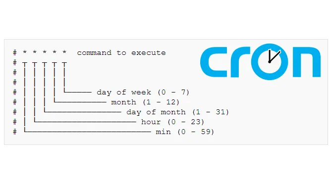

**cron** = wiederholtes ausführen von Befehlen  
**at** = Einmaliges ausführen eines Befehls

| Command    | Function                                             |
| :--------- | :--------------------------------------------------- |
| **crontab -e** | Editieren von cronjobs                               |
| **crontab -l** | Listen der cronjobs                                  |
| **crontab -r** | Löschen der gesamten (eigenen) crontabelle!          |
| **at**         | Einmaliges ausführen eines Befehls zu gegebener Zeit |
| **atq**        | Queue anzeigen                                       |
| **atrm**       | Einen Eintrag löschen                                |

Below are some examples of scheduling cron jobs.

|Schedule|Description|Example|
|---|---|---|
|`0 0`|Run a script at midnight every day|`0 0 /path/to/script.sh`|
|`_/5_`|Run a script every 5 minutes|`/5 /path/to/script.sh`|
|`0 6 1-5`|Run a script at 6 am from Monday to Friday|`0 6 1-5 /path/to/script.sh`|
|`0 0 1-7`|Run a script on the first 7 days of every month|`0 0 1-7 /path/to/script.sh`|
|`0 12 1`|Run a script on the first day of every month at noon|`0 12 1 /path/to/script.sh`|

