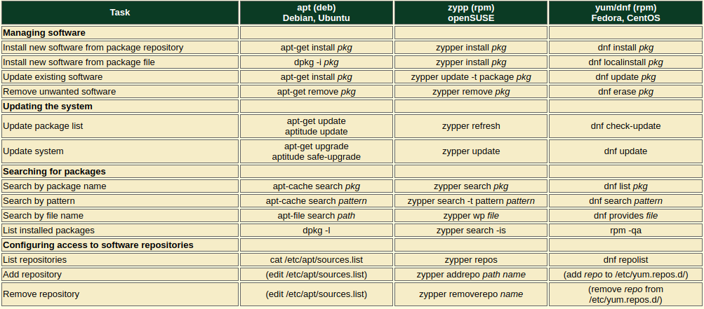

**Package Naming Convention**
```
package-name_version-release_architecture.deb
```
**RPM und dpkg**  
Grundlegende Werkzeuge zur Verwaltung einzelner Pakete ohne erweiterte Funktionen wie automatische Abhängigkeitsauflösung.
**DNF und APT**  
Darauf aufbauende, benutzerfreundliche High-Level-Tools, die diese Funktionen bereitstellen und die Paketverwaltung im täglichen Einsatz erheblich erleichtern.

### YUM 
*für ältere RHEL, CentOS*
```bash
yum update                                      # Systemaktualisierung
yum install [paket]                             # Paket installieren
yum remove [paket]                              # Paket deinstallieren
yum search [paket]                              # Nach einem Paket suchen
yum list installed                              # Installierte Pakete anzeigen
yum clean all                                   # Paket-Cache bereinigen
```
### DNF 
*Nachfolger von YUM, für RHEL, Fedora, CentOS*
```bash
dnf update                                      # Systemaktualisierung
dnf install [paket]                             # Paket installieren
dnf remove [paket]                              # Paket deinstallieren
dnf search [paket]                              # Nach einem Paket suchen
dnf list installed                              # Installierte Pakete anzeigen
dnf clean all                                   # Paket-Cache bereinigen
```
### RPM
```bash
rpm -i [package.rpm]                            # Installiert ein .rpm-Paket
rpm -U [package.rpm]                            # Upgradet oder installiert ein .rpm-Paket
rpm -e [package]                                # Entfernt ein installiertes Paket
rpm -q [package]                                # Zeigt Informationen zu einem Paket an
rpm -qa                                         # Listet alle installierten Pakete auf
rpm -V [package]                                # Verifiziert ein installiertes Paket
rpm -qf                                         # Find installed package containing file
rpm -ql [package]                               # List files in package
```
### APT 
*für Debian, Ubuntu, Linux Mint*
```bash
apt update                                      # Paketlisten aktualisieren
apt upgrade                                     # Systemaktualisierung
apt update && sudo apt upgrade -y               # Update repositories and install updates -yes to all
apt install [paket]                             # Paket installieren
apt remove [paket]                              # Paket deinstallieren
apt search [paket]                              # Nach einem Paket suchen
apt list --installed                            # Installierte Pakete anzeigen
apt autoremove                                  # Nicht mehr benötigte Pakete entfernen
apt clean                                       # Paket-Cache bereinigen
```
### DPKG
```bash
dpkg -i [package.deb]                           # Installiert ein .deb-Paket
dpkg -r [package]                               # Entfernt ein installiertes Paket
dpkg -P [package]                               # Entfernt ein Paket samt Konfigurationsdateien (Purge)
dpkg -l                                         # Listet alle installierten Pakete auf
dpkg -L [package]                               # Zeigt alle Dateien, die von einem Paket installiert wurden
dpkg -s [package]                               # Zeigt Statusinformationen zu einem Paket an
```
### PACMAN 
*für Arch Linux, Manjaro*
```bash
pacman -Syu                                     # Systemaktualisierung
pacman -S [paket]                               # Paket installieren
pacman -R [paket]                               # Paket deinstallieren
pacman -Ss [paket]                              # Nach einem Paket suchen
pacman -Q                                       # Installierte Pakete anzeigen
pacman -Sc                                      # Paket-Cache bereinigen
pacman -Rns [paket]                             # Paket und Abhängigkeiten entfernen
```

<div class="img-center">
    
</div>