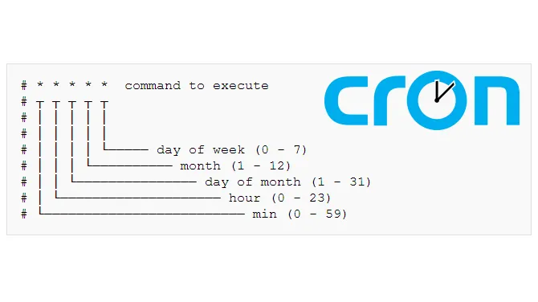

**cron** = wiederholtes ausführen von Befehlen  
**at** = Einmaliges ausführen eines Befehls

| Command    | Function                                             |
| :--------- | :--------------------------------------------------- |
| **crontab -e** | Editieren von cronjobs                               |
| **crontab -l** | Listen der cronjobs                                  |
| **crontab -r** | Löschen der gesamten (eigenen) crontabelle!          |
| **at**         | Einmaliges ausführen eines Befehls zu gegebener Zeit |
| **atq**        | Queue anzeigen                                       |
| **atrm**       | Einen Eintrag löschen                                |

